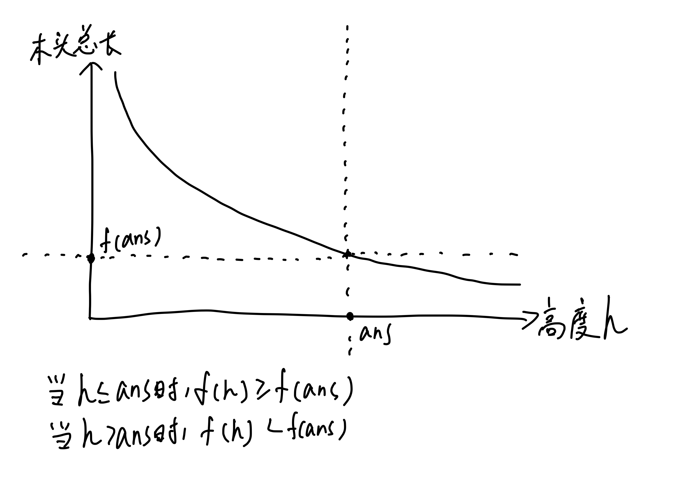

# 二分答案

常见的关键字眼：求最大值，求最小值，最大值最小化，最小值最大化。

类似于二分查找，二分答案也要求题目具有某种单调性。

二分答案和二分查找本质没有区别。

## 引入

### 背景 1

回想二分查找：给定不减数列 $a_1, a_2, \dots, a_n$，查找 $x$ 的第一次出现位置。

我们将整个数列分成了两段：$\lt x$ 和 $\ge x$。也就是说，我们定义了一个条件为 $a_p \ge x$，要求找到**最小的** $p$ 使得条件成立。

即，找到一个【符合条件的最小值】。


实际上我们二分了一个答案（即第一次出现位置），然后判定答案是否可行。

二分答案的思路通常出现在，直接求解答案很困难，需要通过二分答案然后转而判断答案是否合法的可行性问题。

## 背景 2

有 $N$ 个任务要完成。有两个人，他们完成一项任务的时间分别为 $x, y$。你可以任意地把任务分配给两个人去完成。请你求出至少需要多少时间才能完成所有任务。

$N \le 10^6$：枚举分配第一个人的任务数量。

$N , x , y \le 10^9$：

- 定义 $f(t)$ 表示时间 $t$ 内能完成的任务量。则 $f(t) = \lfloor \frac{t}{x} \rfloor + \lfloor \frac{t}{y} \rfloor$。
- 随着 $t$ 的增大，$f(t)$ 单调不减。
- 二分答案 $t$，找到最小的合法的 $t$，即找到最小的满足 $f(t) \ge N$ 的时间 $t$​。
- 时间 $O(\log V)$，其中 $V = 10^{18}$。

相当于用二分优化枚举。

### 背景 3

有 $n$ 棵树高度为 $a_1, a_2, \dots, a_n$。你砍树时可以选择一个高度 $h$，你可以获得每棵树上比 $h$ 高的部分的木头。现在要收集到总共长度至少为 $m$ 的木头，为了保护环境，求 $h$ 的最大值。$a_i \le 10^9, N \le 10^5$。

直接求解答案非常困难，我们不妨从小到大枚举答案，然后计算收集到的木头总长，判定答案是否合法。枚举算法如下：

```cpp
// 令 f(x) 表示当 h = x 时收集到的木头长度。
// 时间复杂度 O(V * N)，其中 V 表示枚举答案的范围，其中计算 f(h) 的时间复杂度为 O(N)
for (int h = 0; f(h) >= m; h++) {
  ans = h;
}
```

随着 $h$ 的增大，收集到的木头总长越来越小，大致图像如下。



我们令函数 $f(h)$ 表示高度为 $h$ 时收集到的木头总长，则题目转化为找到满足 $f(h) \ge m$ 的最大值 $h$。因此可以使用二分算法。

```cpp
int l = 查找范围左端点, r = 查找范围右端点;  // 具体初始化由题目决定
while (l < r) {
  int mid = (l + r + 1) >> 1;
  f(mid) >= m ? l = mid : r = mid - 1;
}
// 答案为 l
```

## 整数二分

答案的取值为整数。假设我们有一个布尔函数 $f(x)$，答案所在的区间（即答案的定义域）为 $[L, R]$。布尔函数的取值 $true, false$ 可以用来表示答案是否合法。

时间复杂度 $O(\log V)$，其中 $V$ 为答案的取值范围。

### 最小化合法的 $x$——最小值模型

当 $f(x)$ 不减时，求最小的 $x$ 使得 $f(x) = true$。例如下表给出的 $f(x)$，答案为 $4$。

```
f(1) = 0
f(2) = 0
f(3) = 0
f(4) = 1
f(5) = 1
```

如果将 $f(x) = 0, 1$ 分别视作非法、合法，则是要求你求出最小的合法的 $x$，并且可以发现：

* 若 $y \lt x$，$f(y) = 0$，即分界线左半区间非法。
* 若 $y \ge x$，$f(y) = 1$，即分界线右半区间合法。
* 函数值形如 $0000000 \dots 0011 \dots 111111$。

模板代码如下：

```cpp
int BinarySearch(int L, int R) {  // 答案所处的范围
  int left = L, right = R + 1;  // 如果所有答案均非法，返回 R + 1
  while (left < right) {
    int mid = (left + right) >> 1;  // 寻找区间的中点（向下取整）
    f(mid) ? right = mid : left = mid + 1;
  }
  return left;  // 用 left == R + 1 判定是否均非法
}
```

例题：逐月 P1608 P1609

### 最大化合法的 $x$——最大值模型

当 $f(x)$ 不增时，求最大的 $x$ 使得 $f(x) = true$。例如下表给出的 $f(x)$，答案为 $3$。

```
f(1) = 1
f(2) = 1
f(3) = 1
f(4) = 0
f(5) = 0
```

如果将 $f(x) = 0, 1$ 分别视作非法、合法，则是要求你求出最大的合法的 $x$，并且可以发现：

* 若 $y \lt x$，$f(y) = 1$，即分界线左半区间合法。
* 若 $y \ge x$，$f(y) = 0$，即分界线右半区间非法。
* 函数值形如 $1111 \dots 1100 \dots 0000$。

模板代码如下：

```cpp
int BinarySearch(int L, int R) {  // 答案所处的范围
  int left = L - 1, right = R;  // 如果所有答案均非法，返回 L - 1
  while (left < right) {
    int mid = (left + right + 1) >> 1;  // 寻找区间的中点（向上取整）
    f(mid) ? left = mid : right = mid - 1;
  }
  return left;  // 用 left == L - 1 判断是否均非法
}
```

例题：洛谷 P2440 P1873

## 实数二分

答案的取值为实数。相比整数二分代码少了很多细节。这里以最大化合法的答案为例。

```cpp
// 精度设置一般比题目要求多两位，例如题目要求保留5位小数，则 eps=1e-7
// 精度越高，所需循环次数越多
// 以求最大的合法的 x 为例
const double eps = 1e-7;  

while (right - left > eps) {
  double mid = (left + right) / 2;
  f(mid) ? left = mid : right = mid;
}

// 或者

// 直接指定二分次数
for (int i = 0; i < 100; i++) {
  double mid = (left + right) / 2;
  f(mid) ? left = mid : right = mid;
}
```

两份代码分别通过常量 $eps$ 和循环次数来控制二分精度：

* 如果 $eps$ 过小或者 for 循环次数过多，而 $f$ 函数的计算时间复杂度较大，则可能超时 TLE；
* 如果 $eps$ 过大或者 for 循环次数过少，则精度可能不满足题目要求，导致答案错误 WA。

实数二分的精度设置、循环次数比较讲究经验，需要调参。

例题：逐月 P1610 P1611

### 误差

标准答案为 $x$，你输出的答案为 $y$。在信息学的意义下，绝对误差为 $|x - y|$，相对误差为 $\frac{|x - y|}{x}$。

## 题目讲解

对于某些题目，如果没法直接求解答案，那就枚举答案，然后判定答案是否合法。

- 如何判定合法？合法条件是什么？
- 是否存在单调性？如果存在单调性，那就用二分答案。

### 最优化模型

洛谷 P1608 P1609

### 最大最小值模型——洛谷 P1182 数列分段

题目所求的答案为每段和最大值 $x$，当 $x$ 已知时，分段数越少越好（第一次贪心）。

令 $f(x)$ 表示当每段和都 $\le x$​ 时的最少分段数。

- 贪心地从前往后进行分段，让每一段塞下尽可能多的数字，这样分出来的段数尽可能少（第二次贪心）。
  - 对于每个数字，能放前一段就放前一段，不能放就创建一个新的段。

随着 $x$ 的增大，$f(x)$ 不会增加。二分答案 $x$，合法条件为最终段数 $f(x) \le m$。贪心的分段数 $\lt m$ 时，可以拆几个数字出来让段数变为 $m$。

随着 $x$ 的增大，最终段数随之减少，问题具有单调性，可以二分答案。

- 简单来说，如果 $f(x)$ 表示答案 $x$ 是否合法，那么 $x$ 越大，答案越来越合法，$f(x)$ 的取值为 $000 \dots 0011 \dots 111$。

- 二分答案 $x$，贪心地模拟分段，判定答案是否合法。使用求最小的合法的 $x$ 的模型。

- 二分答案的 $x$ 的初始范围为 $[\max( a_i ), \min ( \sum a_i, 10^9 )]$。时间复杂度 $O(N \log V)$，其中 $V$ 表示二分初始范围的大小。

??? 代码

    ```cpp
    #include <bits/stdc++.h>

    using namespace std;

    const int MAXN = 1e5 + 1;

    int n, m, a[MAXN], l = 0, r = 1e9;

    int F(int x) {
      int sum = 0, cnt = 1;
      for (int i = 1; i <= n; i++) {
        if (sum + a[i] <= x) {
          sum += a[i];
        } else {
          sum = a[i], cnt++;
        }
      }
      return cnt <= m;
    }

    int main() {
      ios::sync_with_stdio(0), cin.tie(0);
      cin >> n >> m;
      for (int i = 1; i <= n; i++) {
        cin >> a[i];
        l = max(l, a[i]);
      }
      while (l < r) {
        int mid = (l + r) >> 1;
        F(mid) ? r = mid : l = mid + 1;
      }
      cout << l;
      return 0;
    }
    ```

>
有余力时深入思考：如何证明贪心分段方案中，一定能有和为 $x$ 的子段？

### 实数二分——洛谷 P1163 银行贷款

$\sum$ 求和，$\prod$ 求积。$\sum \limits_{i = 1} ^ n a_i = a_1 + a_2 + \dots + a_n$。$\prod \limits_{i = 1} ^ n a_i = a_1 \times a_2 \times \dots \times a_n$

求的答案为：利率 $p$。

单调性：$p$ 越大，$\sum \limits_{i = 1}^k \dfrac{m}{(1 + p)^i}$ 越小。

二分范围：$[0, 500]$ 之间的实数。

模型：实数二分。
