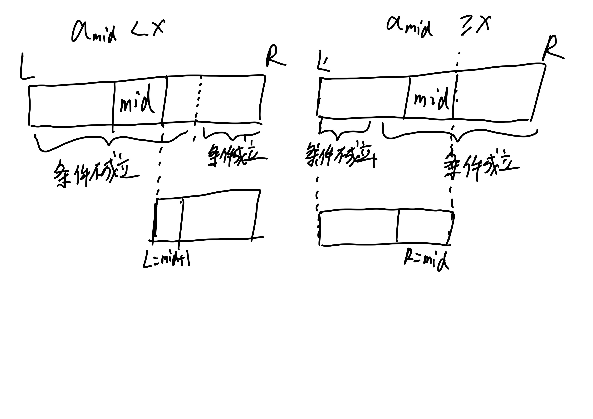

# 二分答案

常见的关键字眼：求最大值，求最小值，最大值最小化，最小值最大化。

类似于二分查找，二分答案也要求题目具有某种单调性。

## 二分查找与二分答案

回想二分查找：给定不减数列 $a_1, a_2, \dots, a_n$，查找 $x$ 的第一次出现位置。

我们将整个数列分成了两段：$\lt x$ 和 $\ge x$。也就是说，我们定义了一个条件为 $a_p \ge x$，要求找到**最小的** $p$ 使得条件成立。

即，找到一个**符合条件的最小值**。



实际上我们二分了一个答案（即第一次出现位置），然后判定答案是否可行。

因此，二分答案和二分查找在本质上没有区别。

对于一些直接求解答案很困难的题目，需要通过二分答案然后转而判定答案是否合法来求解答案。

## 整数二分

答案的取值为整数。假设我们有一个布尔函数 $f(x)$，答案所在的区间（即答案的定义域）为 $[L, R]$。布尔函数的取值 $true, false$ 可以用来表示答案是否合法。

时间复杂度 $O(\log V)$，其中 $V$ 为答案的取值范围。

### 最小化合法的 $x$——最小值模型

当 $f(x)$ 不减时，求最小的 $x$ 使得 $f(x) = true$。例如下表给出的 $f(x)$，答案为 $4$。

```
f(1) = 0
f(2) = 0
f(3) = 0
f(4) = 1
f(5) = 1
```

如果将 $f(x) = 0, 1$ 分别视作非法、合法，则是要求你求出最小的合法的 $x$，并且可以发现：

* 若 $y \lt x$，$f(y) = 0$，即分界线左半区间非法。
* 若 $y \ge x$，$f(y) = 1$，即分界线右半区间合法。
* 函数值形如 $0000000 \dots 0011 \dots 111111$。

模板代码如下：

```cpp
int BinarySearch(int L, int R) {
  int left = L, right = R;  // 初始化答案所处的范围
  int ans = -1;             // 初始化答案为无解标记
  while (left <= right) {
    int mid = (left + right) / 2;
    if (f(mid)) {
      right = mid - 1;
      ans = mid;
    } else {
      left = mid + 1;
    }
  }
  return ans;  // 用 -1 判定是否无解
}
```

例题：逐月 P1608 P1609

### 最小值模型例题讲解

!!! 逐月 P1609 打印机

    有 $N$ 个海报要打印。有两台打印机，他们各自打印一份海报的时间分别为 $x, y$。你可以任意地把任务分配给两台打印机去完成。请你求出至少需要多少时间才能完成所有任务。$N \le 2 \times 10^8$，$x, y \le 10$

如果 $N \le 10^6$：

- 我们可以枚举分配给第一台打印机的海报数量 $i$，那么第二台打印机需要打印的海报数量为 $N - i$
- 此时需要的总时间为 $\max \{ i \times x, (N - i) \times y \}$
- 对于每个 $i$，求出最小的总时间
- 时间复杂度 $O(N)$

而题目中的 $N \le 2 \times 10^8$，显然不能枚举 $N$。但是我们可以发现这样一种单调性：

- 如果在时间 $x$ 内能完成任务，那么在时间 $x + 1$ 内也一定能完成任务。

也就是说，随着所需时间逐渐变大，能打印的海报的数量越来越多，这就是题目中暗含的单调性。因此我们可以使用二分答案的思想来完成：

- 定义 $f(t)$ 表示时间 $t$ 内能打印的海报数量。则 $f(t) = \lfloor \frac{t}{x} \rfloor + \lfloor \frac{t}{y} \rfloor$。
- 随着 $t$ 的增大，$f(t)$ 单调不减。
- 在时间 $t$ 内能完成任务，等价于，$f(t) \ge N$。
- 答案的范围不会超过 $\max \{ x, y \} \times N$，不会少于 $1$，可以用它们来初始化二分的范围。
- 二分答案 $t$，找到最小的、合法的（符合条件的）$t$，即找到最小的满足 $f(t) \ge N$ 的时间 $t$​。
- 时间复杂度 $O(\log V)$，其中 $V = 2 \times 10^9$。
- 在思路上，用二分答案优化枚举答案。

??? 代码

    ```cpp
    #include <bits/stdc++.h>

    using namespace std;

    int n, x, y;

    bool Check(int t) {
      return t / x + t / y >= n;
    }

    int main() {
      ios::sync_with_stdio(0), cin.tie(0);
      cin >> n >> x >> y;
      int l = 1, r = 1e9, ans = -1;
      while (l <= r) {
        int mid = (l + r) / 2;
        if (Check(mid)) {
          r = mid - 1;
          ans = mid;
        } else {
          l = mid + 1;
        }
      }
      cout << ans;
      return 0;
    }
    ```

### 最大化合法的 $x$——最大值模型

当 $f(x)$ 不增时，求最大的 $x$ 使得 $f(x) = true$。例如下表给出的 $f(x)$，答案为 $3$。

```
f(1) = 1
f(2) = 1
f(3) = 1
f(4) = 0
f(5) = 0
```

如果将 $f(x) = 0, 1$ 分别视作非法、合法，则是要求你求出最大的合法的 $x$，并且可以发现：

* 若 $y \lt x$，$f(y) = 1$，即分界线左半区间合法。
* 若 $y \ge x$，$f(y) = 0$，即分界线右半区间非法。
* 函数值形如 $1111 \dots 1100 \dots 0000$。

模板代码如下：

```cpp
int BinarySearch(int L, int R) {
  int left = L, right = R;  // 初始化答案所处的范围
  int ans = -1;             // 初始化答案为无解标记
  while (left <= right) {
    int mid = (left + right) / 2;
    if (f(mid)) {
      left = mid + 1;
      ans = mid;
    } else {
      right = mid - 1;
    }
  }
  return ans;  // 用 -1 判定是否无解
}
```

例题：洛谷 P2440 P1873

### 最大值模型例题讲解

!!! 洛谷 P1873 砍树

    有 $n$ 棵树高度为 $a_1, a_2, \dots, a_n$。你砍树时可以选择一个高度 $h$，你可以获得每棵树上比 $h$ 高的部分的木头。现在要收集到总共长度至少为 $m$ 的木头，为了保护环境，求 $h$ 的最大值。$a_i \le 10^9, N \le 10^5$。

直接求解答案非常困难，我们不妨从小到大枚举答案，然后计算收集到的木头总长，判定答案是否合法。枚举算法如下：

```cpp
// 令 check(x) 为一个布尔函数（判定合法性函数），表示当 h = x 时收集到的木头长度是否至少为 $m$。
bool check(int x) {
  // 如何实现 f 函数请学生思考完成
}

for (int h = 0; !check(h); h++) {  // 不断枚举答案直到合法
  ans = h;
}
```

可以发现本题这样一个单调性：随着 $h$ 的增大，收集到的木头总长越来越小。

- 换句话说，如果答案 $h$ 能符合题目要求，那么答案 $h - 1$ 也能符合题目要求。

因此题目可以转化为，找到符合条件的最大值 $h$。因此可以使用二分算法。

??? 代码

```cpp
#include <iostream>
#include <algorithm>

using namespace std;

const int MAXN = 1e6 + 1;

int n, m, maxa, a[MAXN];

bool Check(int h) {
  long long sum = 0;
  for (int i = 1; i <= n; i++) {
    sum += max(0, a[i] - h);
  }
  return sum >= m;
}

int Find() {
  int l = 0, r = maxa, ans = -1;
  while (l <= r) {
    int mid = (l + r) / 2;
    if (Check(mid)) {
      l = mid + 1;
      ans = mid;
    } else {
      r = mid - 1;
    }
  }
  return ans;
}

int main() {
  ios::sync_with_stdio(0), cin.tie(0);
  cin >> n >> m;
  for (int i = 1; i <= n; i++) {
    cin >> a[i];
    maxa = max(maxa, a[i]);
  }
  cout << Find();
  return 0;
}
```

## 实数二分

答案的取值为实数。相比整数二分代码少了很多细节。这里以最大化合法的答案为例。

### 实现 1：控制答案精度

```cpp
// 精度设置一般比题目要求多两位，例如题目要求保留5位小数，则 eps=1e-7
// 精度越高，所需循环次数越多
// 以求最大的合法的 x 为例
const double eps = 1e-7;  

double left = , right = ;
while (right - left > eps) {
  double mid = (left + right) / 2;
  Check(mid) ? left = mid : right = mid;
}

// 答案就是 left 或 right
```

### 实现 2：控制二分次数

```cpp
// 直接指定二分次数
// 精度越高，所需循环次数越多
// 以求最大的合法的 x 为例
for (int i = 0; i < 100; i++) {
  double mid = (left + right) / 2;
  Check(mid) ? left = mid : right = mid;
}

// 答案就是 left 或 right
```

两份代码分别通过常量 $eps$ 和循环次数来控制二分精度：

* 如果 $eps$ 过小或者 for 循环次数过多，而 $f$ 函数的计算时间复杂度较大，则可能超时 TLE；
* 如果 $eps$ 过大或者 for 循环次数过少，则精度可能不满足题目要求，导致答案错误 WA。

实数二分的精度设置、循环次数比较讲究经验，需要调参。

例题：逐月 P1610 P1611，洛谷 P1577

### 实数二分例题讲解

逐月 P1611

### 扩展

误差的定义：

- 令标准答案为 $x$，你输出的答案为 $y$。
- 在信息学的意义下，绝对误差为 $|x - y|$，相对误差为 $\frac{|x - y|}{x}$。

## 题目讲解

对于某些题目，如果没法直接求解答案，那就枚举答案，然后判定答案是否合法。

- 如何判定合法？合法条件是什么？
- 是否存在单调性？如果存在单调性，那就用二分答案。

### 最小化最大值模型——洛谷 P1182 数列分段

题目所求的答案为每段和最大值 $x$，当 $x$ 已知时，分段数越少越好（第一次贪心）。

令 $f(x)$ 表示当每段和都 $\le x$​ 时的最少分段数。

- 贪心地从前往后进行分段，让每一段塞下尽可能多的数字，这样分出来的段数尽可能少（第二次贪心）。
    - 对于每个数字，能放前一段就放前一段，不能放就创建一个新的段。

随着 $x$ 的增大，$f(x)$ 不会增加。二分答案 $x$，合法条件为最终段数 $f(x) \le m$。贪心的分段数 $\lt m$ 时，可以拆几个数字出来让段数变为 $m$。

随着 $x$ 的增大，最终段数随之减少，问题具有单调性，可以二分答案。

- 简单来说，如果 $check(x)$ 表示答案 $x$ 是否合法，那么 $x$ 越大，答案越来越合法，$check(x)$ 的取值为 $000 \dots 0011 \dots 111$。
- 二分答案 $x$，贪心地模拟分段，判定答案是否合法。使用求最小的合法的 $x$ 的模型。
- 二分答案的 $x$ 的初始范围为 $[\max( a_i ), \min ( \sum a_i, 10^9 )]$。时间复杂度 $O(N \log V)$，其中 $V$ 表示二分初始范围的大小。

>
有余力时深入思考：如何证明贪心分段方案中，一定能有和为 $x$ 的子段？

### 最大化最小值模型——洛谷 P1824 进击的奶牛

### 实数二分模型——洛谷 P1163 银行贷款

$\sum$ 求和，$\prod$ 求积。$\sum \limits_{i = 1} ^ n a_i = a_1 + a_2 + \dots + a_n$。$\prod \limits_{i = 1} ^ n a_i = a_1 \times a_2 \times \dots \times a_n$

求的答案为：利率 $p$。

单调性：$p$ 越大，$\sum \limits_{i = 1}^k \dfrac{m}{(1 + p)^i}$ 越小。

二分范围：$[0, 500]$ 之间的实数。

模型：实数二分。
