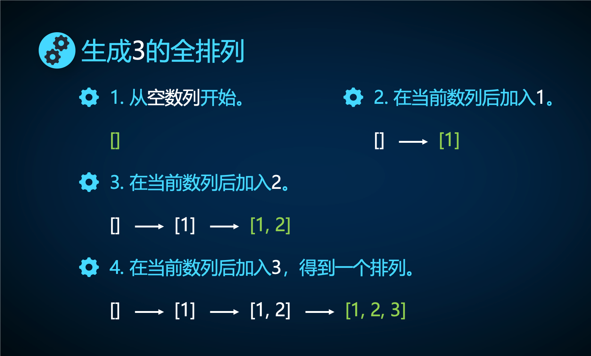
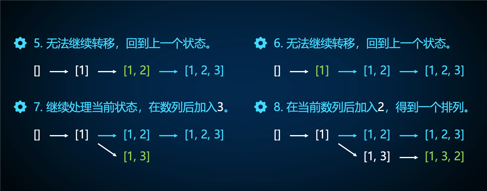
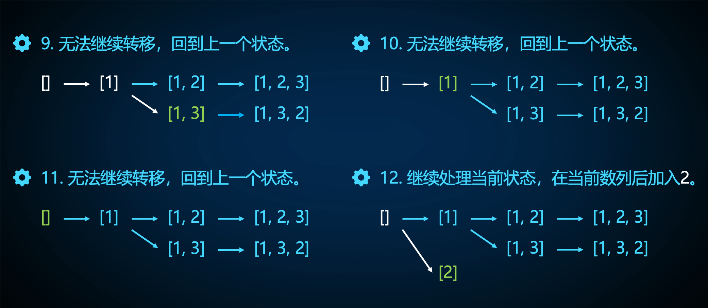
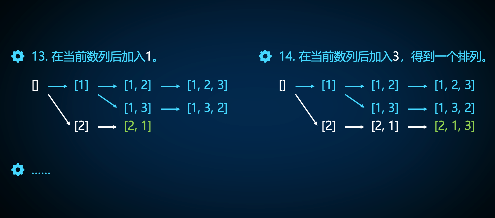
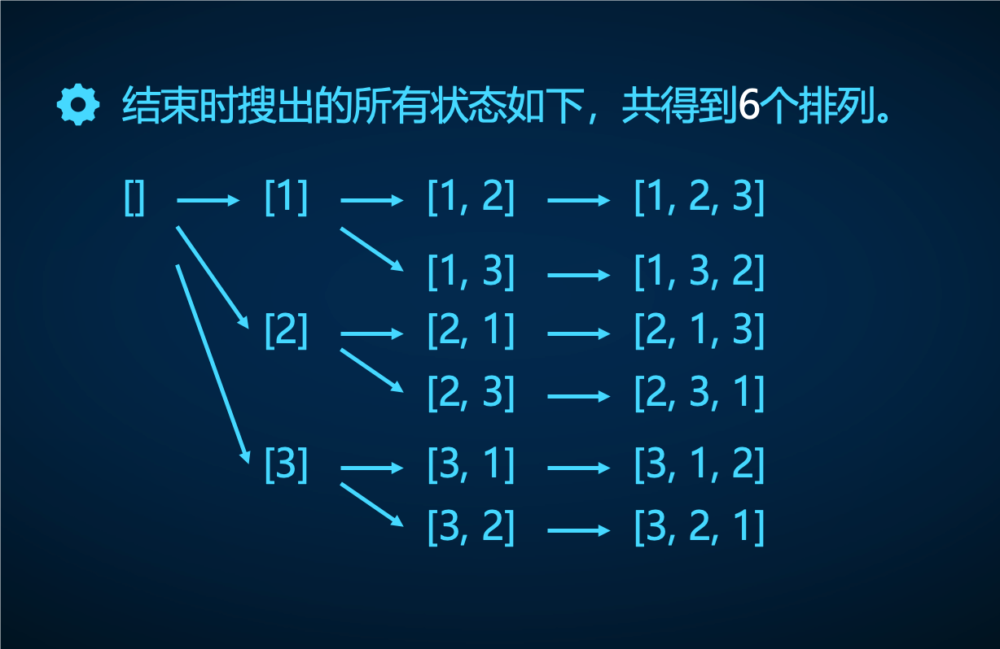

# dfs的四个基本模型

## 排列搜索

!!! 题意

    枚举（生成） $1 \sim n$ 的全排列并按字典序的方式输出所有全排列。

排列是一个由 $1 \sim n$ 构成的长度为 $n$ 的序列，且每个数字出现恰好一次。

### 状态和转移

状态是还未生成完全的排列序列，转移是往该序列末尾添加一个没有出现的数字。

状态转移的变化和状态转移图如下（带着学生画图理解递归和回溯的过程）：











### 步骤和代码

!!! 代码

    === "数组"

        ```cpp
        #include <iostream>
        #include <iomanip>  // setw 头文件

        using namespace std;

        int n, ans;
        int a[15];  // 状态
        bool v[15]; // 标记每个数字是否出现

        // 生成全排列中的第 t 个数字
        // 状态：全排列序列
        void S(int t) {
          if (t == n + 1) {  // 生成了全排列
            for (int i = 1; i <= n; i++) {
              cout << setw(5) << a[i];  // 5 个场宽
            }
            cout << '\n';
            return;
          }
          for (int i = 1; i <= n; i++) {  // 转移：往序列添加一个没有出现过的数字
            if (!v[i]) {
              a[t] = i;  // 记录序列
              v[i] = 1;  // 标记出现
              S(t + 1);  // 确定下一位数字
              v[i] = 0;  // 回溯，重新标记为未出现（回溯：回到原来的状态）
            }
          }
        }

        int main() {
          cin >> n;
          S(1);
          return 0;
        }
        ```
    === "vector 记录全排列序列"

        ```cpp
        #include <iostream>
        #include <vector>
        #include <iomanip>  // setw 头文件

        using namespace std;

        int n, ans;
        vector<int> a;  // 状态
        bool v[15]; // 标记每个数字是否出现

        // 生成全排列中的第 t 个数字
        // 状态：全排列序列
        void S(int t) {
          if (t == n + 1) {  // 生成了全排列
            for (int x : a) {
              cout << setw(5) << a[i];
            }
            cout << '\n';
            return;
          }
          for (int i = 1; i <= n; i++) {  // 转移：往序列添加一个没有出现过的数字
            if (!v[i]) {
              a.push_back(i);  // 记录序列
              v[i] = 1;  // 标记出现
              S(t + 1);  // 确定下一位数字
              v[i] = 0;  // 回溯，重新标记为未出现（回溯：回到原来的状态）
              a.pop_back();  // 回溯
            }
          }
        }

        int main() {
          cin >> n;
          S(1);
          return 0;
        }
        ```

### 时空复杂度

空间复杂度：保存全排列和标记每个数字是否使用过，$O(n)$。

时间复杂度：

- 枚举所有全排列，$O(n!)$，对于每个排列序列，枚举未出现数字 $O(n)$。输出一个全排列，$O(n)$。
- 总时间复杂度 $O(n \times n!)$。

在 $1$ 秒的时间限制下，时间复杂度 $O(n!)$ 和 $O(n \cdot n!)$ 的算法一般适用于 $n \le 10$ 的数据范围。

## 组合搜索

!!! 题意

    枚举（生成）从 $1 \sim n$ 中挑选 $m$ 个元素的组合。按照字典序的方式输出每个组合。

组合搜索与排列搜索进行对比：

- 排列中的数字顺序可以随意变化，即排列需要考虑数字顺序。
- 组合中的数字一般按递增的方式给出，不需要考虑数字之间的顺序（只关心选了哪些数）。

### 状态和转移

状态是还未生成完全的组合序列，转移是**往序列末尾添加一个比上一个数字大**的数（保证字典序）。

由于在组合中后一个数字一定比前一个大，因此无需标记数字是否使用。

状态转移图不给出，要求学生自己画出 $n = 5, m = 3$ 的状态转移图。

### 步骤和代码

```cpp
#include <iostream>
#include <iomanip>

using namespace std;

int a[20], n, m;
// vector<int> a;

// 确定组合中第 x 个数字，last 表示上一个数字
// 状态：组合数序列
void dfs(int x, int last) {
  if (x == m + 1) {  // 生成了组合
    for (int i = 1; i <= m; i++) {
      cout << setw(3) << a[i];
    }
    /*
    for (int x : a) {
      cout << setw(3) << x;
    }
    */
    cout << endl;
    return;
  }
  for (int i = last + 1; i <= n; i++) {  // 每次往序列末尾添加比上一个数字大的数字
    a[x] = i;                            // 记录序列
    // a.push_back(i);
    dfs(x + 1, i);
  }
}

int main() {
  cin >> n >> m;
  dfs(1, 0);
  return 0;
}
```

### 时空复杂度

空间复杂度：保存组合，$O(m)$。

时间复杂度：

- 枚举所有组合，$O(C_{n}^{m})$。
- 输出一个组合，$O(m)$。
- 总时间复杂度 $O(m \times C_{n}^{m})$。

组合搜索具体所用时间根据题目的 $n, m$ 决定。

## 子集搜索

!!! 题意

    生成集合 $\{ 1, 2, \dots, n\}$ 的所有的子集。

组合搜索与子集搜索进行对比：

- 组合更偏向于考虑下一个数字选什么。
- 子集搜索更偏向于依次考虑每个数字是否在子集中。

### 状态和转移

状态是集合和当前考虑的数字，转移是考虑当前元素是否添加到子集中。

状态转移图不给出，要求学生自己画出 $n = 4$ 的状态转移图。可以先引导学生如何画集合的状态转移图。

### 代码

```cpp
#include <iostream>
#include <iomanip>

using namespace std;

int n, a[30];
// vector<int> a;

// 考虑第 t 个元素是否在子集中
void S(int t, int m) {
  if (t == n + 1) {  // n 个元素考虑完毕
    for (int i = 0; i < m; i++) {
      cout << a[i] << ' ';
    }
    cout << '\n';
    return;
  }
  a[t] = i;         // 元素 t 属于子集
  // a.push_back(i);
  S(t + 1, m + 1);  // 递归处理
  a[t] = 0;         // 元素 t 不属于子集
  // a.pop_back();
  S(t + 1, m);      // 递归处理
}

int main() {
  cin >> n;
  S(1, 0);
  return 0;
}
```

### 时空复杂度

空间复杂度：每个递归 $O(1)$，$n$ 层递归 $O(n)$，记录子集 $O(n)$。

时间复杂度：枚举所有子集 $O(2^{n})$，输出一个子集最坏 $O(n)$，总时间复杂度 $O(n \cdot 2^n)$。实际计算方法参考下方式子：

$$
\sum \limits_{i = 0} ^ n i \cdot C_n^i = 0 \cdot C_n^0 + 1 \cdot C_n^1 + \dots + n \cdot C_n^n = n \cdot 2^{n - 1}
$$

在 $1$ 秒的时间限制下，时间复杂度 $O(2^n)$ 和 $O(n \cdot2^n)$ 的算法一般适用于 $n \le 25$ 和 $n \le 20$ 的数据范围。

### 例题：洛谷 P2677

（没时间写题意）

状态：$(x, sum)$，表示当前考虑到第 $x$ 头奶牛，已选奶牛总高度为 $sum$。

转移：

- 不选第 $x$ 头奶牛：$(x, sum) \to (x + 1, sum)$
- 选第 $x$ 头奶牛：$(x, sum) \to (x + 1, sum + a_x)$。

使用子集搜索实现，时间复杂度 $O(2^n)$。

## 网格图

!!! 题意

    洛谷 P1605。给定一个带障碍的网格图迷宫，每次可以从当前格子移动到上下左右相邻的一个非障碍格子，求出从起点到终点的路径方案数。

### 状态和转移

状态是当前所处坐标 $(x,y)$，转移是四个方向走一遍，即 $(x, y) \to (x + 1, y), (x - 1, y), (x, y + 1), (x, y - 1)$。

从起点（起始状态）开始搜索路径，每当走到终点（目标状态）时记录路径方案数。

不要求学生画出转移图，根据代码和步骤进行理解。

### 步骤和代码

```cpp
#include <iostream>

using namespace std;

const int N = 10;                // 迷宫的大小
const int dx[] = {0, -1, 0, 1};  // 方向
const int dy[] = {-1, 0, 1, 0};  // 方向

int n, m, t, ans;
int sx, sy, tx, ty;
int x, y;
bool a[N][N];

// 状态：坐标 (x, y)
void S(int x, int y) {
  if (x < 1 || x > n || y < 1 || y > m || a[x][y]) {  // 判断状态是否超出边界、状态是否遍历过
    return;
  }
  if (x == tx && y == ty) {
    ans++;
    return;
  }
  a[x][y] = 1;  // 标记已走过
  for (int i = 0; i < 4; i++) {
    S(x + dx[i], y + dy[i]);  // 转移：上下左右走
  }
  a[x][y] = 0;  // 回溯
}

int main() {
  cin >> n >> m >> t;
  cin >> sx >> sy >> tx >> ty;
  for (int i = 0; i < t; i++) {  // 标记障碍
    cin >> x >> y;
    a[x][y] = 1;
  }
  S(sx, sy);
  cout << ans;
  return 0;
}
```

### 时空复杂度

空间复杂度：记录迷宫和状态访问数组，最多 $O(n \times m)$ 层递归，空间复杂度 $O(n \times m)$。

时间复杂度：$O(4^{nm})$，由于并不是每次都可以做四次转移，因此实际上达不到该时间复杂度。

一般情况下，网格图搜索适用于 $n, m \le 20$ 的数据范围（也不一定是 $20$，只要网格图比较小，数据出的比较弱，该搜索就能拿 $20$ 分左右）。

## 搜索题目讲解

可以通过观察数据范围的方式猜测使用什么搜索。

### $n$ 皇后

!!! 题意

    $n \times n $ 的网格棋盘，摆放 $n$ 个皇后，使得任意两个皇后均不在同一行、列、对角线上。每行皇后所在的列作为方案，输出所有方案。

按照第一行、第二行、$\dots$、第 $n$ 行的顺序，枚举每一行的一个皇后所在的位置，由于任意两个皇后均不在同一行和列上，相当于是枚举列的全排列。

令 $(x_i, y_i)$ 表示第 $i$ 个皇后所在的位置，用 $y_i$ 表示它的列，用 $x_i + y_i, x_i - y_i$ 表示经过它的两条对角线。

状态为棋盘的局面，转移是放置一个新皇后。

```cpp
#include <iostream>

using namespace std;

int n, a[15], cnt;
bool used[15], used1[30], used2[30];  // 列标记，左上到右下、右上到左下的对角线标记

void Print() {  // 输出
  for (int i = 1; i <= n; i++) {
    cout << a[i] << ' ';
  }
  cout << endl;
}

// 行数为 1 ~ n，列数为 1 ~ n 的一个全排列
// 表示搜第 x 行棋子摆放的位置（列的位置）y
// 左上到右下方向的对角线可以用 x - y 来唯一标识
// 右上到左下方向的对角线可以用 x + y 来唯一标识
void dfs(int x){  // 放置第 x 个皇后
  if (x == n + 1) {
    cnt++;
    if (cnt <= 3) {
      Print();
    }
    return ;
  }
  for (int i = 1; i <= n; i++) {                           // 枚举放置的列
    if (!used[i] && !used1[x - i + n] && !used2[x + i]) {  // 所在列和两条对角线均没有皇后
      used[i] = used1[x - i + n] = used2[x + i] = 1;       // 标记
      a[x] = i;                                            // 记录方案
      dfs(x + 1);                                          // 搜索下一个皇后的位置
      used[i] = used1[x - i + n] = used2[x + i] = 0;       // 回溯
    }
  }
}

int main(){
  cin >> n;
  dfs(1);
  cout << cnt;
  return 0;
}
```

你也可以采用 `next_permutation` 来实现这道题。

空间复杂度：记录方案和标记数组，一共 $O(n)$。

时间复杂度：枚举 $n$ 个皇后所在的列的位置，$O(n!)$。

### 开心的金明

观察到 $m \lt 25$，使用子集搜索。

状态：$(i, sum, res)$ 表示当前考虑第 $i$ 个物品，之前花了 $sum$ 元、价格与重要度乘积之和为 $res$。

转移：$(i, sum, res) \rightarrow (i + 1, sum ,res), (i + 1, sum + v_i, res + v_ip_i)$。

总时间复杂度 $O(2^m)$。

### 自然数拆分

!!! 题意

    给定正整数 $n$，按字典序输出所有的拆分方案。

观察到拆分方案中，后一个数字不比前一个数字小，考虑使用类似于组合式的搜索。

同时，由于按字典序输出所有方案，因此考虑从小到大枚举拆分的数做转移。

注意数字和不能超过 $n$，否则有可能无线递归。

```cpp
#include <iostream>

using namespace std;

int n, a[10];

// 状态：末尾数字 last，数字和 s
// 转移：添加一个不比 last 小的数字 i，(last, s) 转移到 (i, s + i)
void S(int x, int s, int last) {
  if (s == n) {
    cout << a[0];
    for (int i = 1; i < x; i++) {
      cout << '+' << a[i];
    }
    cout << '\n';
    return;
  }
  for (int i = last; i < n && s + i <= n; i++) {  // 保证数字和不超过 n
    a[x] = i;
    S(x + 1, s + i, i);
  }
}

int main() {
  cin >> n;
  S(0, 0, 1);
  return 0;
}
```

时间复杂度不是很好分析。

### 特殊的质数肋骨

!!! 题意

    一个数是特殊的，当且仅当原数是质数，并且每次去掉最低位数字后仍然是质数。从小到大输出所有特殊的 $n$ 位数。

从高位往低位枚举每一位数，只有当前数为质数才搜索下一位数。

状态为 $(x, t)$，表示当前数字为 $x$，需要确定第 $t$ 位数。转移是往末尾添加一位数 $i$，转移到 $(10x + i, t - 1)$。

```cpp
#include <iostream>

using namespace std;

int n;

bool isprime(int n) {  // 判断质数
  if (n <= 1) {
    return 0;
  }
  for (int i = 2; i * i <= n; i++) {
    if (n % i == 0) {
      return 0;
    }
  }
  return 1;
}

// 状态：数字 x
// 转移：在 x 后面添加一位数
void dfs(int x, int t) {
  if (t == -1) {
    cout << x << endl;
    return ;
  }
  for (int i = 1; i <= 9; i++) {  // 转移
    if (isprime(x * 10 + i)) {    // 是质数才转移
      dfs(x * 10 + i, t - 1);
    }
  }
}

int main() {
  cin >> n;
  dfs(0, n - 1);
  return 0;
}
```

在实现时，最高位枚举 $2, 3, 5, 7$，其他较低位枚举 $1, 3, 7, 9$，减少搜索次数。这种减少无用搜索的技巧被称为**可行性剪枝**。

### 健康的荷斯坦奶牛

!!! 题意

    给定一头奶牛所需的 $n$ 种维他命的数量，和 $m$ 种饲料包含的 $n$ 种维他命数量，每种饲料使用一次。求出使用饲料种数最少的方案，若存在多个方案，输出饲料编号字典序最小的那个一个。

搜索每种饲料是否选取，当搜索出一种选取饲料的方案，判断方案是否合法，并维护答案。

```cpp
// lg-P1460
#include <iostream>
#include <climits>

using namespace std;

const int MAXN = 20;
const int MAXM = 30;

int w[MAXM], a[MAXN][MAXM], res[MAXN], ans[MAXN];
int ansc = INT_MAX, v, g;

void dfs(int x, int w[], int c){
  if (x == g + 1){
    bool f = 1;
    for (int i = 1; i <= v; i++){
      f &= w[i] <= 0;
    }
    if (f && c < ansc){
      ansc = c;
      for (int i = 1; i <= c; i++){
        ans[i] = res[i];
      }
    }
    return ;
  }
  res[c + 1] = x;
  for (int i = 1; i <= v; i++){
    w[i] -= a[x][i];
  }
  dfs(x + 1, w, c + 1);
  for (int i = 1; i <= v; i++){
    w[i] += a[x][i];
  }
  dfs(x + 1, w, c);
}

int main(){
  cin >> v;
  for (int i = 1; i <= v; i++){
    cin >> w[i];
  }
  cin >> g;
  for (int i = 1; i <= g; i++){
    for (int j = 1; j <= v; j++){
      cin >> a[i][j];
    }
  }
  dfs(1, w, 0);
  cout << ansc;
  for (int i = 1; i <= ansc; i++){
    cout << ' ' << ans[i];
  }
  return 0;
}
```

空间复杂度：记录所需维他命 $O(n)$，记录饲料 $O(n \times m)$，记录方案 $O(m)$，总共 $O(n \times m)$。

时间复杂度：搜索选取方案 $O(2^m)$，维护所需维他命量总共 $O(n \times 2^m)$，记录一个选取方案最坏 $O(m)$，总共 $O((n + m)2^m)$。

### 走迷宫

注意题目细节（无解，走路方向优先顺序，没有重复的点）。注意检查你的输出结果和答案的输出结果。

时间复杂度 $O(4^{nm})$，实际上远达不到。