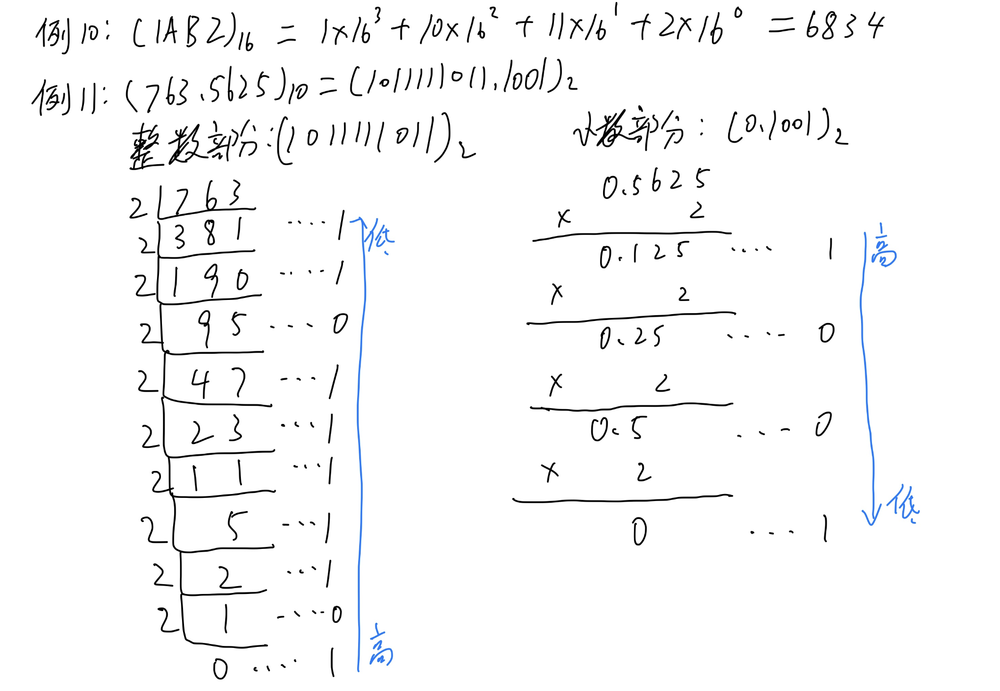

# 进制

## 符号

数量是抽象的，用物体、符号代替数量（结绳计数、算盘、正字计数）。

阿拉伯数字的符号为 $0 \sim 9$。我们常用阿拉伯数字来表示数量。

## 进制

进制：按照一定比例对符号进行换算。

基数：进制数，可以使用的不同符号的数量。

## 位

数量是无限的，不能使用无限的符号来表示数量，而摆放符号的位置是无限的，这些位置就被称为位。

书写规范：左边为高位，右边为低位。整数部分最低位编号为 $0$，忽略前缀 $0$；小数部分最高位编号为 $-1$，忽略后缀 $0$。

位权：当前位的 $1$ 与 $0$ 号位的 $1$ 之间的换算比例，$i$ 号位的位权为基数的 $i$ 次方。可以理解为每个位置对应的单位值。

以十进制为例：

| 位号 | 2            | 1           | 0          |     | -1              |
| ---- | ------------ | ----------- | ---------- | --- | --------------- |
| 位权 | $10^2 = 100$ | $10^1 = 10$ | $10^0 = 1$ | .   | $10^{-1} = 0.1$ |
| 符号 | 4            | 5           | 6          | .   | 7               |

数值为：$4 \cdot 10^2 + 5 \cdot 10^1 + 6 \cdot 10^0 + 7 \cdot 10^{-1} = 456.7$。其中 $a^{-b} = \frac{1}{a^b}$，并且乘幂运算有性质 $a^b \cdot a^c = a^{b+c}$。

## 进制表示

最简表示：每一位上的符号只有一个。

从低位换算到相邻高位，称为进位。从高位换算到相邻低位，称为借位。高位的 $1$ 等价于相邻低位的基数。

对于非最简表示，每一位上有多个符号，需要通过进位、借位将其转为最简表示：

| 位号     | 2            | 1           | 0          | 数值                                                |
| -------- | ------------ | ----------- | ---------- | --------------------------------------------------- |
| 位权     | $10^2 = 100$ | $10^1 = 10$ | $10^0 = 1$ |                                                     |
| 最简表示 | 4            | 5           | 6          | $4 \cdot 10^2 + 5 \cdot 10^1 + 6 \cdot 10^0= 456$   |
| 其他表示 | 2            | 25          | 6          | $2 \cdot 10^2 + 25 \cdot 10^1 + 6 \cdot 10^0= 456$  |
| 其他表示 | 1            | 28          | 76         | $1 \cdot 10^2 + 28 \cdot 10^1 + 76 \cdot 10^0= 456$ |

当基数很大时，每一位上可以有多个符号，只要它小于基数，就是最简表示。例如一个 $92$ 进制数的最简表示：

| 位号 | 2             | 1           | 0          |
| ---- | ------------- | ----------- | ---------- |
| 位权 | $92^2 = 8464$ | $92^1 = 92$ | $92^0 = 1$ |
| 符号 | 27            | 91          | 35         |

数值为 $27 \cdot 92^2 + 91 \cdot 92^1 + 35 \cdot 92^0 = 236935$。

## 二进制

以 $2$ 为基数，符号为 $0$ 和 $1$，$i$ 号位的位权为 $2^i$，高位的 $1$ 等价于相邻低位的 $2$。

例 1：写出十进制 $0 \sim 31$ 的二进制表示。

## 十六进制

以 $16$ 为基数，符号为 $0 \sim 9, \text{A} \sim \text{F}$，依次表示数值 $0 \sim 15$，$i$ 号位的位权为 $16^i$，高位的 $1$ 等价于相邻低位的 $16$。

例 2：写出十进制 $0 \sim 31$ 的十六进制和二进制表示。

## 四则运算

### 加法

逐位相加，由低位到高位处理进位，得到最简表示。也可以相加的同时处理进位。

例 3：写出十进制加法 $459347 + 276156 = 735503$ 的过程。

例 4：写出二进制加法 $110111 + 11011 = 1010010$ 的过程。

### 减法

根据被减数与减数的大小关系确定符号，然后大数减小数，逐位相减，由低位到高位处理借位，得到最简表示。也可以相减的同时处理借位。

例 5：写出十进制减法 $735503 - 459347 = 276156$ 的过程。

例 6：写出二进制减法 $1010010 - 110111 = 11011$ 的过程。

### 乘法

本质是利用乘法分配律拆解运算数来进行运算。

例如十进制下 $\overline{ab} \times \overline{cd} = ac \cdot 10^2 + ad \cdot 10^1 + bc \cdot 10^1 + bd \cdot 10^0$。

枚举被乘数和乘数的两个位号，位号相加得到结果的位号，位权相乘得到结果的位权，位上的数相乘得到结果。得到所有结果后，逐位累加并处理进位得到最终结果。

例 7：写出十进制乘法 $736 \cdot 58 = 42688$ 的过程。

例 8：写出二进制乘法 $1011 \cdot 1101 = 10001111$ 的过程。

### 除法

试除法，由高位到低位得到每一位的商。

例 9：写出十进制除法 $42926 \div 736 = 58 \dots 238$ 的过程。

例 10：写出二进制除法 $110101 \div 101 = 1010 \dots 11$ 的过程。

## 基数运算

将整数 $x$ 乘以基数，相当于在对应进制表示下左移一位。

将整数 $x$ 除以基数，相当于在对应进制表示下右移一位。

将整数 $x$ 对基数取模，相当于取出在对应进制表示下第 $0$ 号位上的数。

例题：逐月 P1431 P1432

## 进制转换

$10$ 进制转 $k$ 进制通常用乘除法，$k$ 进制转 $10$ 进制通常用位值累加法。

$10$ 进制转 $k$ 进制通常对应数值转数字串，$k$ 进制转 $10$ 进制通常对应数字串转数值。

$a$ 进制转 $b$ 进制，通常先将 $a$ 进制转为 $10$ 进制，再转为 $b$ 进制。

### 位值累加法

每一位的数字乘上当前进制位权并累加。

$2$ 进制转 $10$ 进制：$(1101.11)_2 = 1 \cdot 2^3 + 1 \cdot 2^2 + 0 \cdot 2^1 + 1 \cdot 2^0 + 1 \cdot 2^{-1} + 1 \cdot 2^{-2} = 13.75$。

!!! 代码

    === "从高到低的秦九韶算法"

        ```cpp
        string >> s;  // 假设读入一个 k 进制数字串，没有小数部分
        int n = s.size(), ans = 0;
        for (int i = 0; i < n; i++) {  // 从高位到低位扫描数字串
          ans = ans * k + s[i] - '0';
        }
        ```

    === "位值累加法"

        ```cpp
        int base[MAXL];  
        base[0] = 1;
        for (int i = 1; i < MAXL; i++) {
          base[i] = base[i - 1] * k;  // 预处理出每一位的位权
        }

        string >> s;     // 假设读入一个 k 进制数字串，没有小数部分
        int n = s.size(), ans = 0;
        for (int i = 0; i < n; i++) {
          ans += (s[i] - '0') * base[n - i - 1];  // 累加每一位的数字乘以当前进制位权
        }
        ```

### 乘除法

将每一位移动到 $0$ 号位并取出：

* 使用除法，除以目标进制基数，由低到高求出整数部分
* 使用乘法，乘以目标进制基数，由高到低求出小数部分

$10$ 进制转 $16$ 进制：$(1234)_{10} = (4D2)_{16}$。

例 10：将 $(1\text{AB}2)_{16}$ 转成 $10$ 进制。

例 11：将 $(763.5625)_{10}$ 转成 $2$ 进制。



例题：洛谷 B3619 B3620

### 按位转换

$a$ 进制转 $a^k$ 进制互转使用按位转换法。一般都用与 $a = 2$ 的情况。

$a$ 进制转 $a^k$ 进制：将小数点对齐，整数部分和小数部分每 $k$ 分一组，对每组做进制转换。

$a^k$ 进制转 $a$ 进制：每一位分成 $k$ 位 $a$ 进制。

$(23.17)_8 = (010011.001111)_2$，$(10110.10111)_2 = (16.\text{B}8)_{16}$。