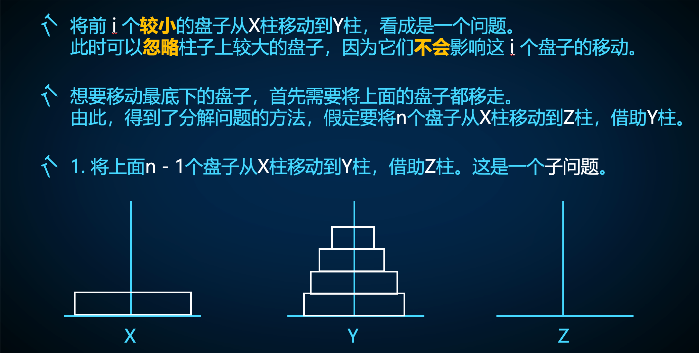
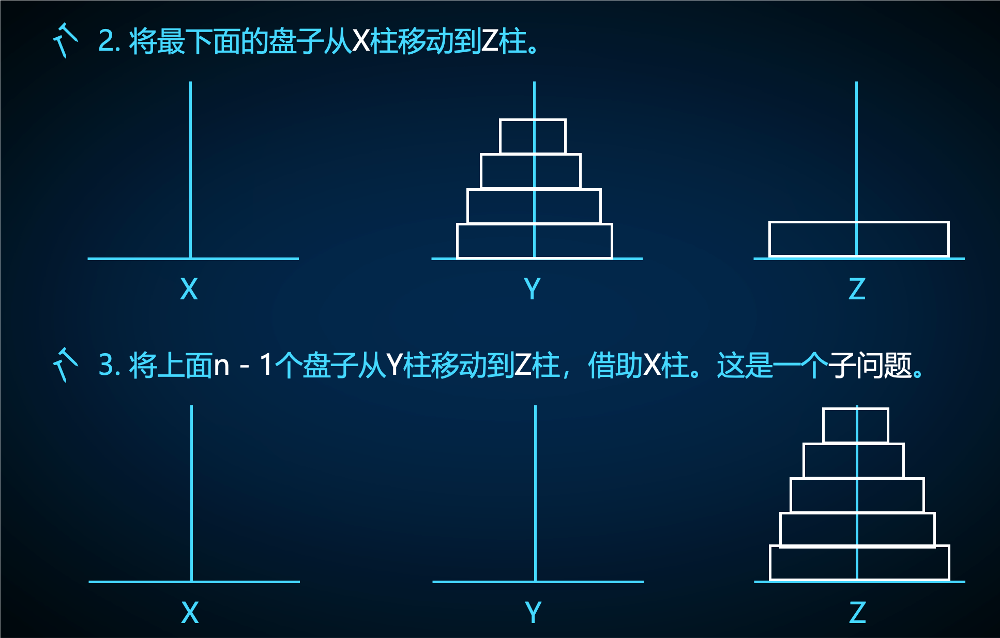

# 递归与分治

分治是一种将大问题分解为同类型子问题来解决的思想，通常包含三步：将原问题划分为子问题、处理子问题、用子问题的结果解决原问题。

通常用递归来实现分治思想：

- 用递归调用来划分、处理子问题。
- 用函数通过子问题结果解决大问题。

```cpp
void Solve(大问题) {
  if (递归边界，即最小的子问题) {
    return ;
  }
  Solve(子问题 1);
  Solve(子问题 2);
  ......
  // 利用子问题的结果解决原问题
}
```

## 洛谷 P1448 汉诺塔

（最好能图示演示一下如何解决汉诺塔）

原问题：把 $n$ 个圆盘从 $A$ 柱移动到 $B$ 柱，借助 $C$ 柱，用 $f(n, A, B, C)$ 表示。

可以把原问题分解为 $3$ 个子问题：

1. 把前 $n - 1$ 个圆盘从 $A$ 柱移动到 $C$ 柱，借助 $B$ 柱，用 $f(n - 1, A, C, B)$ 表示。
2. 把第 $n$ 个圆盘从 $A$ 柱移动到 $B$ 柱。
3. 把前 $n - 1$ 个圆盘从 $C$ 柱移动到 $B$ 柱，借助 $A$ 柱，用 $f(n - 1, C, B, A)$ 表示。

当 $n = 0$ 时是最小的子问题，我们不需要移动圆盘了。原问题为 $f(n, A, B, C)$。

经过一些数学证明，这样的移动次数是最少的。





```cpp
// 将 n 个圆盘从 A 柱移动到 B 柱，借助 C 柱
void F(int n, char A, char B, char C) {
  if (!n) {  // 递归边界，最小的子问题
    return ;
  }
  F(n - 1, A, C, B);                          // 移出前 n - 1 个圆盘
  cout << n << ' ' << A << ' ' << B << '\n';  // 移动最大的第 n 个圆盘
  F(n - 1, C, B, A);                          // 移回前 n - 1 个圆盘
}

F(n, 'A', 'B', 'C');  // 原问题
```

空间复杂度：递归的深度 $O(n)$。

时间复杂度：每个问题会分成 $2$ 个子问题，一共分解出 $O(2^n)$ 个子问题（递归调用树是一个满二叉树），处理每个问题 $O(1)$，总时间复杂度 $O(2^n)$。

## 洛谷 P1885 Moo

$n$ 很大，显然无法通过构造字符串的方式来完成此题。

我们需要知道字符串序列 $\{ S_0, S_1, S_2, \dots, \}$ 从第几项开始才有 $n$ 个字符：

- 通过递推的方式计算出每个字符串的长度。
- 令 $f_i$ 表示字符串 $S_i$ 的长度，则 $f_i = 2f_{i - 1} + i + 3$。
- 找到**最小的** $p$ 使得 $f_p \ge n$。（为什么最小的就够了）

我们可以发现，字符串 $S_i$ 由四个部分组成，依次是：$S_{i - 1}$，$1$ 个 `m`，$i + 2$ 个 `o`，$S_{i - 1}$。定义问题 $F(i, n)$ 为在 $S_i$ 中求出第 $n$ 个字符：

1. 如果 $i = 0$，说明是最小的子问题，可以直接求解答案。
2. 如果 $n <= f_{i - 1}$，说明第 $n$ 个字符在第一项中，原问题答案分解为子问题 $F(i - 1, n)$。
3. 否则，如果 $n \le f_{i - 1} + i + 3$，说明答案为第二项或第三项对应的 `m` 或 `o` 字符。
4. 否则，说明第 $n$ 个字符在第四项中，原问题分解为子问题 $F(i - 1, n - (f_{i - 1} + i + 3))$。（注意 $n$ 的变化）

原问题为 $f(p, n)$。

```cpp
#include <iostream>

using namespace std;

int n, m, f[100] = {3};

char S(int i, int k) {
  if (!i) {  // 递归边界
    return k == 1 ? 'm' : 'o';
  }
  if (k <= f[i - 1]) {
    return S(i - 1, k);  // 第一项
  }
  if (k > f[i - 1] && k <= f[i - 1] + i + 3) {
    return k == f[i - 1] + 1 ? 'm' : 'o';  // 第二、三项
  }
  return S(i - 1, k - (f[i - 1] + i + 3));  // 第四项
}

int main() {
  cin >> n;
  for (; f[m] < n; m++) {
    f[m + 1] = 2 * f[m] + m + 4;
  }
  cout << S(m, n);  // 原问题
  return 0;
}
```

时间复杂度：

- $n$ 很大，但是字符串 $S_{i}$ 的长度每递推一次就翻倍，递推时间复杂度 $O(\log n)$
- 递归分解问题，每个问题最多分解一次，递归深度 $O(\log n)$。
- 总时间复杂度 $O(\log n)$

空间复杂度：递归深度 $O(\log n)$。

## 洛谷 P5461 赦免战俘

!!! 题意

    构造一个 $2^n \times 2^n$ 的矩阵：

    1. 首先将矩阵分为四个的 $2^{n - 1} \times 2^{n - 1}$ 矩阵。
    2. 左上角矩阵全为 $0$。
    3. 其余三个矩阵回到步骤 $1$ 继续构造，直到 $n = 0$。

我们需要记录当前构造的矩阵的规模 $n$，以及矩阵的左上角坐标 $(x, y)$。令 $F(n, x, y)$ 表示对左上角为 $(x, y)$ 的 $2^n \times 2^n$ 的矩阵进行构造：

1. 左上角矩阵可以直接构造
2. 对于其余三个矩阵，递归地处理，分别调用 $F(n - 1, x + 2^{n - 1}, y)$，$F(n - 1, x, y + 2^{n - 1})$，$F(n - 1, x + 2^{n - 1}, y + 2^{n - 1})$。

原问题为 $F(n, 1, 1)$。

```cpp
void Solve(int n, int x, int y) {
  if (!n) {  // 递归边界
    a[x][y] = 1;
    return ;
  }
  // 左上角
  for (int i = 0; i < 1 << n - 1; i++) {
    for (int j = 0; j < 1 << n - 1; j++) {
      a[x + i][y + j] = 0;
    }
  }
  Solve(n - 1, x + (1 << n - 1), y);                 // 左下角
  Solve(n - 1, x, y + (1 << n - 1));                 // 右上角
  Solve(n - 1, x + (1 << n - 1), y + (1 << n - 1));  // 右下角
}
```

时间复杂度：

- 直接分析递归时间复杂度很难，但由于每个格子只会被填一次数，因此总时间复杂度为 $O(2^n \times 2^n) = O(2^n)$。

递归复杂度：递归深度 $O(n)$。

## 题目

逐月 P1448 汉诺塔

洛谷 P1885 Moo

洛谷 P5461 赦免战俘

abc257_c 输出图案

洛谷 P1928 外星密码

洛谷 P1010 幂次方