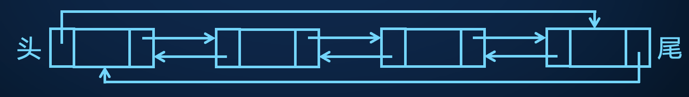

# 链表

单链表


双向链表


循环单链表


循环双链表



## 定义

结点的前一个、后一个结点分别被称为前驱、后继结点。

没有前驱的结点被称为链表头，没有后继的结点被称为链表尾。

通常用编号 $0$ 的结点表示空结点。

```cpp
struct Node {    // 结点的定义【结点部分】
  int nxt, pre;  // 后继，前驱  next precursor
  int v;         // 其他属性，例如结点的值
} a[100];        // 结点

int h, t;  // 记录链表的头尾结点编号【链表部分】，$0$ 表示空节点
```

链表中的结点编号不一定要连续。

## 基本操作

以双向链表为例。

### 判断链表为空

```cpp
bool empty() {
  return h == 0;
}
```

时间复杂度 $O(1)$。

### 遍历

从头结点开始，不断遍历后继，直到遇到空结点。

```cpp
void traverse() {
  for (int i = h; i; i = a[i].nxt) {
    cout << a[i].v << ' ';
  }
}
```

时间复杂度 $O(n)$。

### 增

* 链表为空时插入编号为 $q$ 的结点：

```cpp
h = t = q;
```

* 在头结点前插入插入编号为 $q$ 的结点：

```cpp
a[h].pre = q, a[q].nxt = h, h = q;
```

* 在尾结点后插入插入编号为 $q$ 的结点：

```cpp
a[t].nxt = q, a[q].pre = t, t = q;
```

* 在中间的编号为 $p$ 的结点后插入编号为 $q$ 的结点：

```cpp
a[q].pre = p, a[q].nxt = a[p].nxt;
// a[a[p].nxt].pre = a[p].nxt = q;  // 错误
a[p].nxt = a[a[p].nxt].pre = q;  // 正确
```

* 在中间的编号为 $p$ 的结点前插入编号为 $q$ 的结点：

```cpp
a[q].pre = a[p].pre, a[q].nxt = p;
// a[a[p].pre].nxt = a[p].pre = q;  // 错误
a[p].pre = a[a[p].pre].nxt = q;  // 正确
```

所有插入操作，时间复杂度均为 $O(1)$。

### 删

* 链表只剩一个元素时

```cpp
h = t = 0;
```

* 删除头结点，令头结点的后一个结点为 $p$

```cpp
a[h].nxt = a[p].pre = 0;
h = p;
```

* 删除尾结点，令尾结点的前一个结点为 $p$

```cpp
a[t].pre = a[p].nxt = 0;
t = p;
```

* 删除中间结点 $p$

```cpp
a[a[p].pre].nxt = a[p].nxt;
a[a[p].nxt].pre = a[p].pre;
a[p].nxt = a[p].pre = 0;
```

所有删除操作，时间复杂度均为 $O(1)$。

### 改查

如果查找具有某个值的元素，对链表进行遍历；如果查找链表的第 $k$ 个元素，从链表头开始计数查找。本质是遍历。

```cpp
for (int i = h; i; i = a[i].nxt) {
  // do anything you want
}
```

## 改进

在实现链表的增删功能时，涉及到链表头、链表尾的操作需要特殊处理，比较繁琐。

比较合理的办法是给链表添加一个虚拟头和虚拟尾结点，使得在任意情况下链表中均存在至少两个结点，此时所有的增加、删除结点操作均简化为在链表的中间处进行。

虚拟头结点和虚拟尾结点的编号根据题目要求自行定义。例如有 $n$ 个结点，虚拟头编号为 $n + 1$，虚拟尾编号为 $n + 2$。


代码在逐月 P1440 链表练习中给出。

## 题目

### 逐月P1440 链表练习

请用带虚拟结点的双向链表完成。

查找第 $i$ 个字符，就是在字符串的前或后 $10$ 个字符找到相应的字符。

??? 代码

    === "不带虚拟结点"

        ```cpp
        #include <iostream>

        using namespace std;

        const int MAXN = 5e5 + 1;

        struct Node {    // 结点
          int pre, nxt;  // 前驱后继
          char c;        // 字符
        } a[MAXN];

        char op, c;
        int q, d, n, h, t, len;  // n 为结点编号，len 为链表长度，h 和 t 为链表头尾

        int Find(int x) {                            // 查找第 x 个元素
          int p;                                     // 结点编号
          if (x <= 10) {                             // 离链表头更近
            for (p = h; x > 1; x--, p = a[p].nxt) {  // 从前往后找
            }
          } else {                                      // 离链表尾更近
            for (p = t; x != len; x++, p = a[p].pre) {  // 从后往前找
            }
          }
          return p;
        }

        void Insert() {
          cin >> d >> a[++n].c;  // 输入字符
          if (!h) {              // 链表为空
            h = t = n;
          } else if (!d) {  // 相当于在链表头前插入字符
            a[h].pre = n, a[n].nxt = h, h = n;
          } else if (d == len) {  // 在链表尾插入字符
            a[t].nxt = n, a[n].pre = t, t = n;
          } else {            // 在中间插入字符
            int p = Find(d);  // 寻找插入位置
            a[n].pre = p, a[n].nxt = a[p].nxt;
            a[p].nxt = a[a[p].nxt].pre = n;
          }
          ++len;  // 更新字符串长度
        }

        void Delete() {
          cin >> d;
          if (h == t) {  // 链表为空
            h = t = 0;
          } else if (d == 1) {  // 删除链头
            int p = a[h].nxt;
            a[h].nxt = a[p].pre = 0;
            h = p;
          } else if (d == len) {  // 删除链尾
            int p = a[t].pre;
            a[t].pre = a[p].nxt = 0;
            t = p;
          } else {            // 删除链表中间结点
            int p = Find(d);  // 寻找删除位置
            a[a[p].pre].nxt = a[p].nxt;
            a[a[p].nxt].pre = a[p].pre;
            a[p].nxt = a[p].pre = 0;
          }
          --len;  // 更新字符串长度
        }

        int main() {
          ios::sync_with_stdio(0), cin.tie(0);
          cin >> q;
          while (q--) {
            cin >> op;
            if (op == 'I') {
              Insert();
            } else if (op == 'D') {
              Delete();
            }
          }
          for (int i = h; i; i = a[i].nxt) {
            cout << a[i].c;
          }
          return 0;
        }
        ```

    === “带虚拟结点”

        设置虚拟结点后，插入和删除操作会变得很容易。

        ```cpp
        #include <iostream>

        using namespace std;

        const int MAXN = 5e5 + 3;

        struct Node {    // 结点
          int pre, nxt;  // 前驱后继
          char c;        // 字符
        } a[MAXN];

        char op, c;
        int q, d, n, h, t, len;  // n 为结点编号，len 为链表长度，h 和 t 为链表头尾

        int Find(int x) {                        // 查找第 x 个元素
          int p;                                 // 结点编号
          if (x <= 10) {                         // 离链表头更近
            for (p = h; x; x--, p = a[p].nxt) {  // 从前往后找
            }
          } else {                                      // 离链表尾更近
            for (p = t; x <= len; x++, p = a[p].pre) {  // 从后往前找
            }
          }
          return p;
        }

        void Insert() {
          cin >> d >> a[++n].c;
          int p = Find(d);
          a[n].pre = p, a[n].nxt = a[p].nxt;
          a[p].nxt = a[a[p].nxt].pre = n;
          ++len;
        }

        void Delete() {
          cin >> d;
          int p = Find(d);
          a[a[p].pre].nxt = a[p].nxt;
          a[a[p].nxt].pre = a[p].pre;
          a[p].nxt = a[p].pre = 0;
          --len;
        }

        int main() {
          ios::sync_with_stdio(0), cin.tie(0);
          cin >> q;
          h = q + 1, t = q + 2;  // 虚拟头虚拟尾
          a[h].nxt = t, a[t].pre = h;
          while (q--) {
            cin >> op;
            if (op == 'I') {
              Insert();
            } else if (op == 'D') {
              Delete();
            }
          }
          for (int i = a[h].nxt; i != t; i = a[i].nxt) {
            cout << a[i].c;
          }
          return 0;
        }
        ```

## 洛谷 P1160 队列安排

请双向链表完成。

为了避免上述增加、删除元素的四种情况讨论，可以一开始给链表虚拟出一个头结点、尾结点。这样使得所有的插入删除操作都是在中间进行的。

时间复杂度 $O(n + m)$。

??? 代码

    ```cpp
    #include <iostream>

    using namespace std;

    const int MAXN = 1e5 + 3;

    struct Node {
      int pre, nxt;  // 前驱，后继
    } a[MAXN];

    int n, m, k, p, x, v[MAXN];

    // 在编号为 p 的结点后面插入 q
    void Insert(int p, int q) {
      a[q] = {p, a[p].nxt};
      a[a[p].nxt].pre = q, a[p].nxt = q;
    }

    // 删除编号为 p 的结点
    void Delete(int p) {
      a[a[p].nxt].pre = a[p].pre;
      a[a[p].pre].nxt = a[p].nxt;
      a[p] = {0, 0};
    }

    int main() {
      cin >> n;
      // 初始化链表
      a[n + 1].nxt = a[n + 2].pre = 1;  // 虚拟头 n + 1，虚拟尾 n + 2
      a[1] = {n + 1, n + 2};
      // 插入
      for (int i = 2; i <= n; i++) {
        cin >> k >> p;
        Insert(!p ? a[k].pre : k, i);
      }
      cin >> m;
      for (int i = 0; i < m; i++) {
        cin >> x;
        if (!v[x]) {  // 删除
          v[x] = 1, Delete(x);
        }
      }
      for (int i = a[n + 1].nxt; i != n + 2; i = a[i].nxt) {
        cout << i << ' ';
      }
      return 0;
    }
    ```

## 逐月 P1441 链表练习 2

!!! 题意

    有 $n$ 个序列，每次在序列尾部插入元素，最后从每个序列尾部开始遍历输出序列。

由于我们只在序列的一侧插入，并且没有删除操作，我们可以用 $n$ 个单向链表来模拟序列，链表头就是序列尾部。

单链表。我们可以把每个序列转化为链表，序列的尾部是链表的头结点：

- 在序列尾部插入元素就是在某个链表头结点前插入一个结点。
- 倒序输出序列就是从头结点遍历整个链表。

有 $q$ 个结点，对 $n$ 个链表只需要记录头结点。空间复杂度 $O(n + q)$。

??? 代码

    ```cpp
    struct Node {
      int nxt;  // 后继
      int x;    // 数值
    } a[MAXQ];  // 结点

    int h[MAXN];  // 链头
    ```

    总时间复杂度 $O(n + q)$。

    ```cpp
    #include <iostream>

    using namespace std;

    const int MAXQ = 5e5 + 1, MAXN = 5e3 + 1;

    struct Node {  // 结点
      int nxt, v;  // 后继，值
    } a[MAXQ];

    int h[MAXN];  // 记录所有链表的头结点
    int n, q, x;

    int main() {
      cin >> n >> q;
      for (int i = 1; i <= q; i++) {
        cin >> x >> a[i].v;
        a[i].nxt = h[x], h[x] = i;  // 在链表头的前面插入
      }
      for (int i = 1; i <= n; i++) {  // 输出所有链表
        for (int j = h[i]; j; j = a[j].nxt) {
          cout << a[j].v << ' ';
        }
        cout << '\n';
      }
      return 0;
    }
    ```

## 逐月 P1442 链表练习 3

单链表。我们可以用 $n$ 个链表维护每个序列，每次合并链表时，让链表 $x$ 的尾的后继更新为链表 $y$ 的头，并更新链表 $x$ 的尾结点即可。

时间复杂度 $O(n + q)$。

??? 代码

    ```cpp
    #include <iostream>

    using namespace std;

    const int MAXQ = 5e5 + 1, MAXN = 5e3 + 1;

    struct Node {  // 结点
      int nxt, v;  // 后继，值
    } a[MAXQ];

    int h[MAXN], t[MAXN];  // 链表头、尾
    int n, q, x, y;

    int main() {
      cin >> n >> q;
      for (int i = 1; i <= q; i++) {
        cin >> x >> a[i].v;
        if (!h[x]) {  // 链表为空
          h[x] = t[x] = i;
        } else {  // 在链表尾后插入
          a[t[x]].nxt = i, t[x] = i;
        }
      }
      for (int i = 1; i < n; i++) {
        cin >> x >> y;
        a[t[x]].nxt = h[y];  // 链表 x 的尾的后继是链表 y 的头
        t[x] = t[y];         // 更新链表 x 的尾结点
        h[y] = t[y] = 0;     // 标记被合并链表消失
      }
      for (int i = 1; i <= n; i++) {
        if (h[i]) {                              // 找到唯一的不为空的链表
          for (int j = h[i]; j; j = a[j].nxt) {  // 遍历
            cout << a[j].v << ' ';
          }
        }
      }
      return 0;
    }
    ```

## 其他题目

洛谷 P1996 约瑟夫问题：循环单链表

洛谷 P7912 小熊的果篮：单链表+细节维护。

## 总结

链表：插入和删除 $O(1)$，查询任意一个元素最坏 $O(n)$（不支持下标随机访问），链表中的结点在内存中不一定是连续的一段。

数组：插入和删除最坏 $O(n)$，查询 $O(1)$，数组中的元素在内存中一定是连续的一段。

链表适用于大量插入删除、少量或者具有特殊查询的场景。而数组适用于几乎没有插入删除、大量查询的场景。

涉及到插入和删除操作时，使用双向链表更方便，但代码更多。而只有插入操作时，单链表便于实现。

延伸：栈和队列实际上就是功能受到限制的链表。

- 栈和队列可以用单向链表来实现。用链表模拟栈只需要记录头结点，用链表模拟队列头尾结点都需要记录。
- 循环队列可以用双向链表来实现（涉及到删除操作）。
