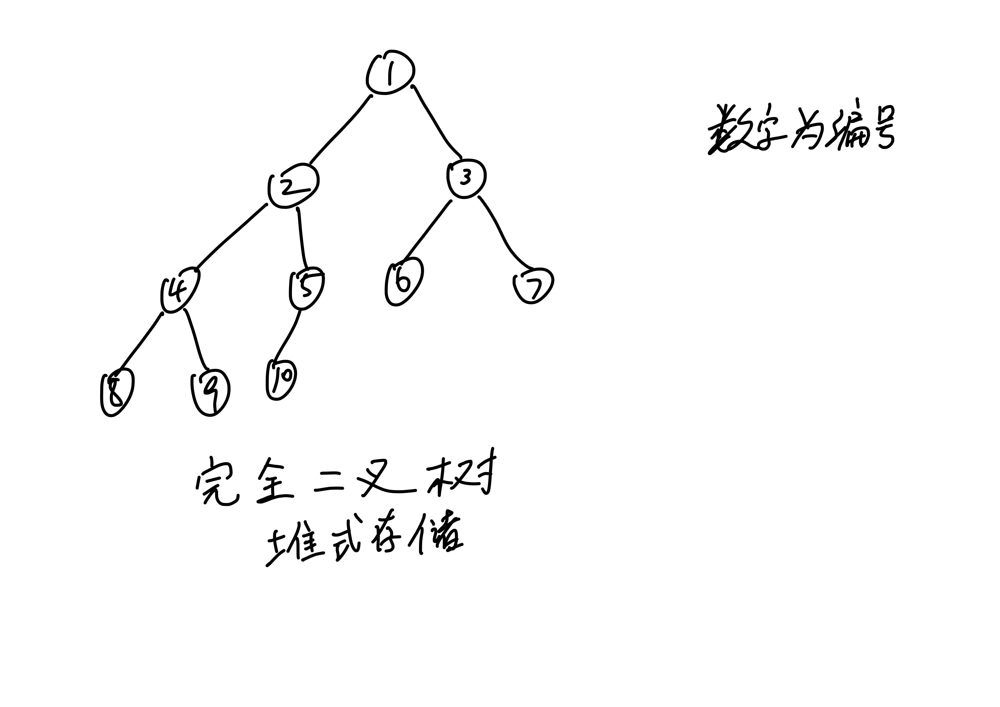
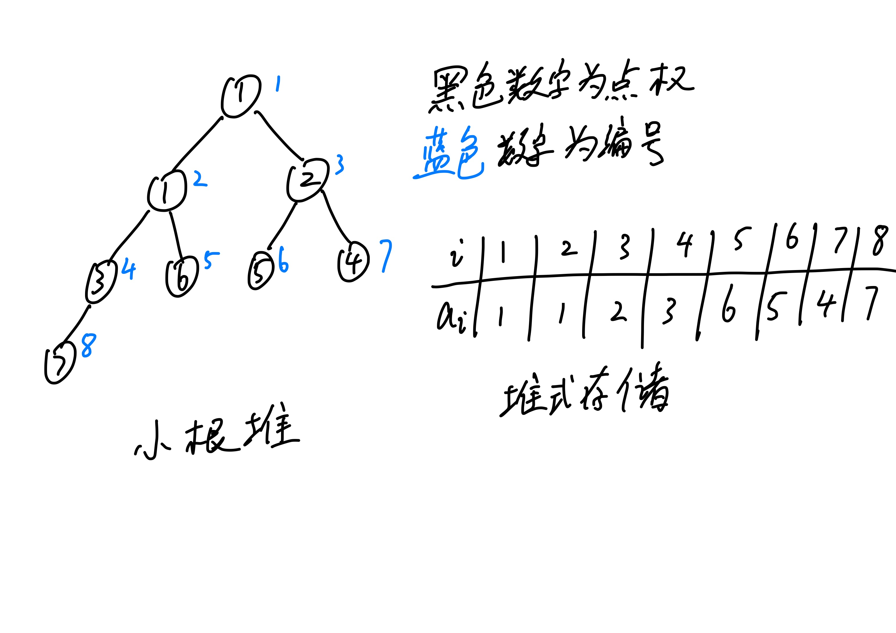
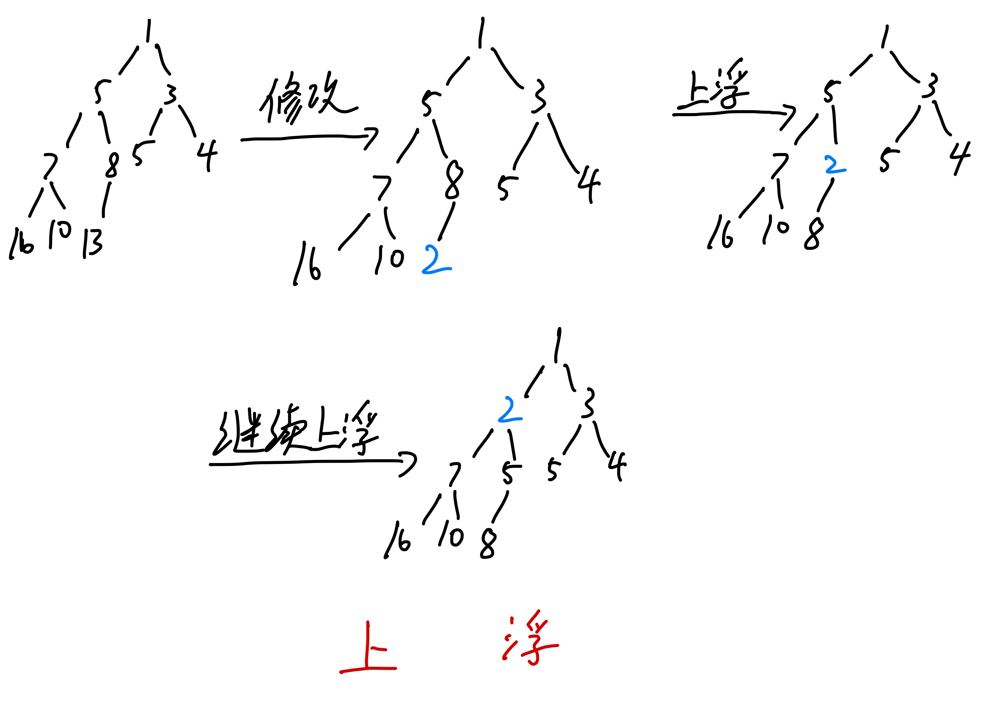
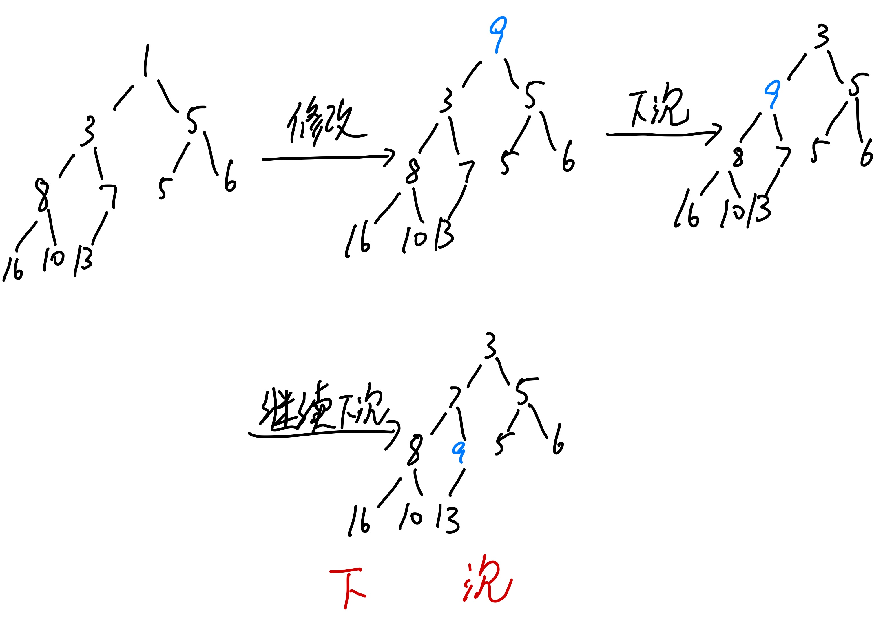
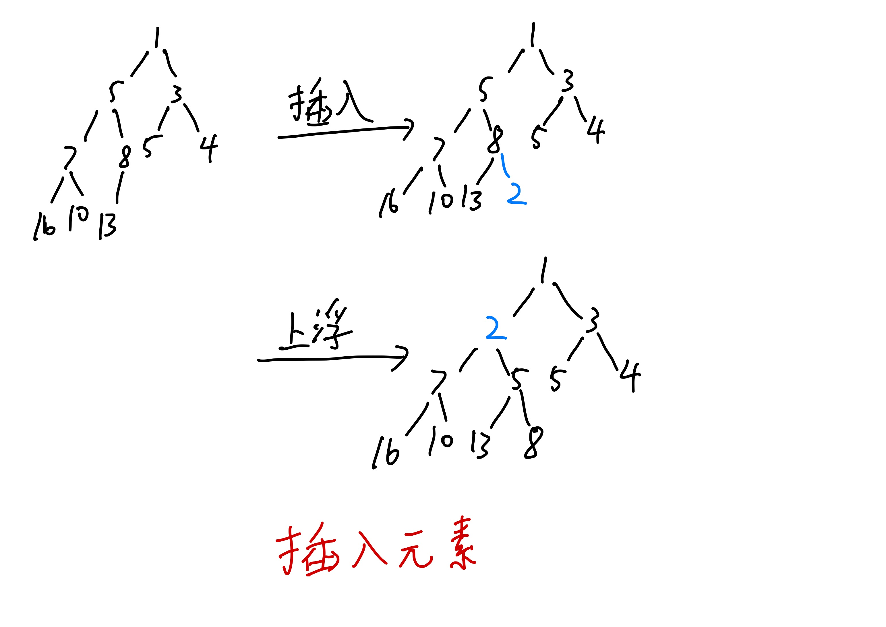
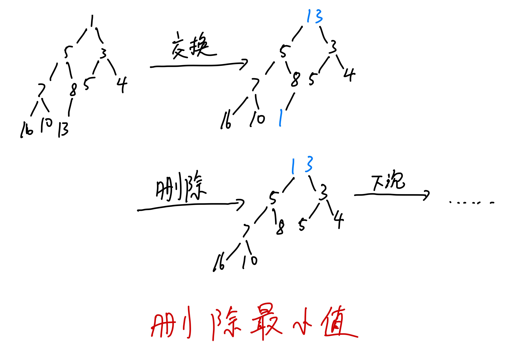

# 二叉堆

## 完全二叉树的存储

可以使用数组模拟链表的方式（记录左右儿子编号）来实现完全二叉树的存储。

```cpp
struct Node {
  int l, r;  // 左右儿子编号
} a[MAXN];
```

实际上可以按顺序给完全二叉树编号，此时编号为 $i$ 的结点的左儿子、右儿子、父亲编号为 $2i, 2i+1,\lfloor \frac{i}{2} \rfloor$。这种存储方式又被称为**堆式存储**。



## 堆

堆是一种支持动态快速查询最值的数据结构，支持以下几种操作：

- 高效插入元素。
- 高效查询、删除最值。
- 高效修改指定元素、删除指定元素.

二叉堆（简称堆）是一棵完全二叉树，它具有如下性质：

* 对于**小根堆**（**大根堆**）而言，父结点的值不大于（不小于）两个儿子的值。

堆的根又被称为堆顶，小根堆的堆顶元素是堆中最小的元素（如何证明？）。

可以使用数组直接存储堆。

```cpp
int a[MAXN], n;  // 数组存储堆，堆的大小，堆中的编号从 1 开始
```



## 基本操作

当对堆进行增删改查的操作时，可能会破坏堆的性质，也可能会让堆不再是完全二叉树，需要考虑如何维护。

下文先介绍两种基本操作：上浮和下沉。这两种操作用来保证堆的性质。本文讲解均以小根堆为例。

### 上浮

当你修改堆中某元素让其变小时：

* 如果元素有父亲，并且值比父亲更小，交换元素，然后继续执行该操作。
* 否则，停止上浮。



```cpp
// 让堆中编号为 x 的结点上浮
void Up(int x) {
  for (int i = x, j = i / 2; j && a[i] < a[j]; i = j, j = i / 2) {  // j 为父亲编号
    swap(a[i], a[j]);
  }
}
```

时间复杂度 $O(\log n)$。

### 下沉

当你修改堆中某元素让其变大时：

* 如果当前元素不是叶子，并且大于较小的儿子时，交换，然后继续执行该操作。
* 否则，停止下沉。



```cpp
// 获取较小儿子编号
int Son(int x) {
  int i = 2 * x, j = 2 * x + 1;
  return i + (j <= n && a[j] < a[i]);
}

// 让堆中编号为 x 的结点下沉
void Down(int x) {
  for (int i = x, j = Son(i); j <= n && a[i] > a[j]; i = j, j = Son(i)) {  // j 为较小儿子编号
    swap(a[i], a[j]);
  }
}
```

时间复杂度 $O(\log n)$。

### 查找最小值

即堆顶。

```cpp
int Top() {
  return a[1];
}
```

时间复杂度 $O(1)$。

### 插入元素

我们可以在完全二叉树的最后一个叶结点右边（即，堆的尾部）增加一个结点，保证堆仍然是一棵完全二叉树。

之后需要上浮来维护堆的性质。



```cpp
void Push(int x) {
  a[++n] = x;
  Up(n);
}
```

时间复杂度 $O(\log n)$。

### 删除最小值

如果直接删除堆顶，会使堆分裂为两个堆，而删除堆尾元素不需要维护。

我们可以将堆顶和堆尾元素进行交换，然后删除堆尾元素，保证堆仍然是一棵完全二叉树。

如果交换后的堆顶不满足堆的性质，需要进行下沉。



```cpp
void Pop() {
  swap(a[1], a[n--]);
  Down(1);
}
```

时间复杂度 $O(\log n)$。

## 用类来实现堆

对于比较复杂的数据结构，可以将其所存储的元素、属性、操作全部封装起来，使代码变得更具有逻辑。

```cpp
struct Heap {
  int a[MAXN], n;

  void Up(int x) {
    for (int i = x, j; (j = i / 2) && a[i] < a[j]; i = j) {
      swap(a[i], a[j]);
    }
  }

  int Son(int j) {
    return j + (j < n && a[j + 1] < a[j]);
  }

  void Down(int x) {
    for (int i = x, j; (j = Son(i * 2)) <= n && a[i] > a[j]; i = j) {
      swap(a[i], a[j]);
    }
  }

  void Push(int x) {
    a[++n] = x, Up(n);
  }

  void Pop() {
    swap(a[1], a[n--]);
    Down(1);
  }

  int Top() {
    return a[1];
  }
} h;
```
