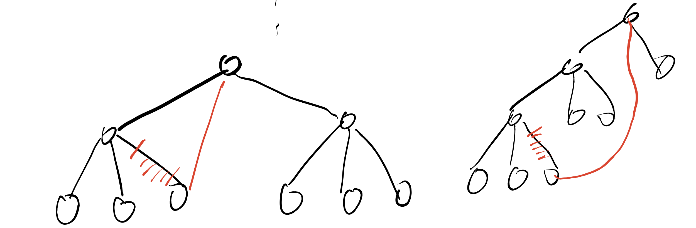

## 哈夫曼树

哈夫曼树：给定 $n$ 个数值，对其构建一棵含有这 $n$ 个数值的带权叶子结点的二叉树，令 $w_i, l_i$ 为叶子结点 $i$ 的权值和到树根的距离，要求最小化 $\sum w_il_i$。

### 步骤

每次选择权值为 $w_1, w_2$ 的最小的且没有父亲的两个结点，新建一个权值为 $w_1 + w_2$  的结点并将之前的两个结点连向该结点。

1. 将 $n$ 个结点权值压入堆中。
2. 执行以下步骤 $n - 1$ 次：
   1. 弹出堆中的最小的两个结点 $u, v$，令值为 $w_u, w_v$，$ans = ans + w_u + w_v$。
   2. 新建一个权值为 $w_u + w_v$ 的结点 $p$，压入堆中，并且令该结点为 $u, v$ 的父亲。

贪心思路：权值越小的结点的 $l_i$ 应尽可能大。

$ans$ 就是最终的 $\sum w_i l_i$。

### 哈夫曼编码

给定字符串和字符串中 $n$ 种字符的出现次数，要求给字符进行一种不定长度的二进制编码，使得将字符串翻译为二进制串后长度最小。将 $n$ 种字符的出现次数构建哈夫曼树，对于树上每个结点，左儿子边为 $0$，右儿子边为 $1$，从树根到叶子结点的路径的二进制串，就是该叶子对应的字符的二进制编码。

该编码的优点：任意一个字符的编码均不是其他所有字符的编码的前缀。

例子：

```
字符：A    B    C    D    E
编码：100  10   11   1    0

编码：10100111
字符串：BACD

不能准确将编码翻译为字符，因为有些字符的编码是其他编码的前缀

字符：A    B    C    D    E
编码：1100 111  1101 10   0
编码：1111100110110
字符串：BACD

如果满足任意一个字符的编码均不是其他所有字符的编码的前缀，可以准确将编码翻译为字符串
```

## 习题讲解

Work Scheduling：后悔贪心，保留调整。

直播获奖，黑匣子：对顶堆。

### [洛谷 P2168 荷马史诗](https://www.luogu.com.cn/problem/P2168)

类似于哈夫曼树，用同样的贪心策略建一棵 $k$ 叉树。$w_i$ 为每个字符出现次数，$l_i$ 为每个字符的 $k$ 进制编码的长度。

如果每次都是取出 $k$ 个最小的权值，仔细发现，最终剩下的堆的大小可能在 $[2, k - 1]$ 之间。例如，$n = 4, k = 3$，最终堆剩下 $2$ 个结点。

错误策略：将堆中剩下的所有结点取出，并连向最终的树根。将一个叶子结点连向树根，可以让 $\sum w_il_i$ 更小。



当 $n = k, 2k - 1, 3k - 2, 4k - 3, \dots = b * (k - 1) + 1 \ (b \ge 1)$，最终堆只会剩下 $1$ 个结点，即树根。

分类讨论求解文章的最短编码长度：

- 当 $(n - 1) \bmod (k - 1) = 0$，按上述做法直接做。
- 当 $(n - 1) \bmod (k - 1) \ne 0$，一开始先加入 $k - 1 - (n - 1) \bmod (k - 1)$ 个 $0$，然后按上述做法直接做。$0$ 一定是在最深的叶子中出现，树的高度也尽可能小。

第二问实际在问需要用尽可能短的 $k$ 进制串来编码。当 $n = 7, k = 3, w = [1, 1, 1, 3, 3, 3, 3]$ 时，有两种以下的哈夫曼树使得最终文章长度都是最短的：


这提示我们在取出权值最短的结点时，还需要考虑当前结点对应的子树的高度。当权值不同时优先取权值小的结点，当权值相同时优先取子树深度小的结点。

### [洛谷 P2278 操作系统](https://www.luogu.com.cn/problem/P2278)

注意：当一个进程 $p$ 还在运行（未结束时），如果来了一个优先级更高的进程 $q$，保留 $p$ 的进度，然后进行 $q$。

枚举每个到来的进程 $i$：

- 先执行完等待队列中不被 $i$ 干扰的进程。
- 如果还剩进程（会被干扰的），令接下来要执行的是进程 $j$，比较 $j$ 和 $i$ 的优先级 $p_j, p_i$
  - $p_j \ge p_i$，执行 $j$，进程 $i$ 在等待队列中
  - $p_j \lt p_i$，执行 $j$ 的一部分直到 $i$ 到来，然后执行 $i$。$i$ 后续是否有优先级更大的进程未知。

将所有进程按照以上步骤加入等待队列后，如果队列中还剩进程，模拟执行。用优先队列维护等待队列，记录每条进程的编号、到达时间、优先级、**剩余**执行时间。

### [洛谷 P3045 Cow Coupons](https://www.luogu.com.cn/problem/P3045)

贪心策略为选择 $C_i$ 小的奶牛用完优惠券（花钱尽可能少），然后剩下奶牛直接购买。这个贪心显然是错的。

假设存在一个直接购买的奶牛 $j$，买完 $j$ 之后的价格 $x \le M$。如果用优惠券买 $j$，意味着用优惠券购买的奶牛集合中有一头要直接购买，令其为 $i$，此时花费 $x - P_j + C_j - C_i + P_i = x + (P_i - C_i) - (P_j - C_j)$。

令 $D_i = P_i - C_i$ 表示使用优惠券可以优惠的钱数，如果 $D_i \lt D_j$，$x + (P_i - C_i) - (P_j - C_j) = x + D_i - D_j \lt x$，所有后面的奶牛中有可能存在用优惠券买的。

贪心调整为，先选择 $C_i$ 小的 $K$ 个奶牛用优惠券，对于剩余的奶牛 $K + 1 \sim N$ 找直接购买花费最少的奶牛 $x$（$P_x$ 最小的）和用优惠券购买花费最少的奶牛 $y$（$C_y$ 最小的），然后选择其中花费最少的情况处理。注意延迟删除的问题。

### [洛谷 P2827 蚯蚓](https://www.luogu.com.cn/problem/P2827)

本题先考虑暴力模拟，维护一个蚯蚓列表，每次在列表中查找蚯蚓长度最大值，切半，然后给其他所有蚯蚓长度 $+q$。时间复杂度 $O(m(n+m))$。

所使用到的查找、切半操作可以使用手写堆或优先队列维护，其他所有蚯蚓长度 $+q$，从相对的视角来看是给分出两个蚯蚓的长度 $-q$。这样单次操作能以 $O(\log (n+m))$ 的时间维护。注意切半时需要先还原为原长度。

对于满分做法，有一个结论是先切半分出的蚯蚓长度 $a, b$ 一定比后切半分出的蚯蚓的长度 $c, d$ 长，即 $a \gt c, b \gt d$，因此可以用三个队列分别存储原来的 $n$ 只蚯蚓（从大到小排好）、切半 $\lfloor px \rfloor$ 的蚯蚓、切半 $x - \lfloor px \rfloor$ 的蚯蚓，每次在三个队头寻找最大值，切半后的蚯蚓放在相应队尾即可。

### [最小函数值](https://www.luogu.com.cn/problem/P2085)

$\mathbb N*$ 是正整数集。根据一些初中代数知识可知，$F_1(x) \sim F_n(x)$ 在 $x \in [1, \infin)$ 上单调递增。类似于最大和，我们将 $F_1(1) \sim F_n(1)$ 存入优先队列中，每次弹出最小值 $F_t(x)$ 后将该函数的下一个值 $F_t(x + 1)$ 压入优先队列，操作 $m$ 次即可。时间复杂度 $O(m \log n)$。