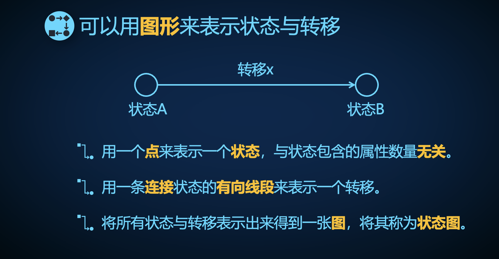
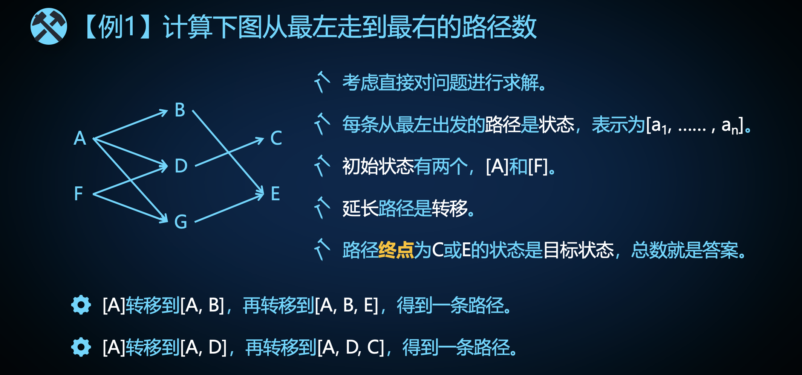
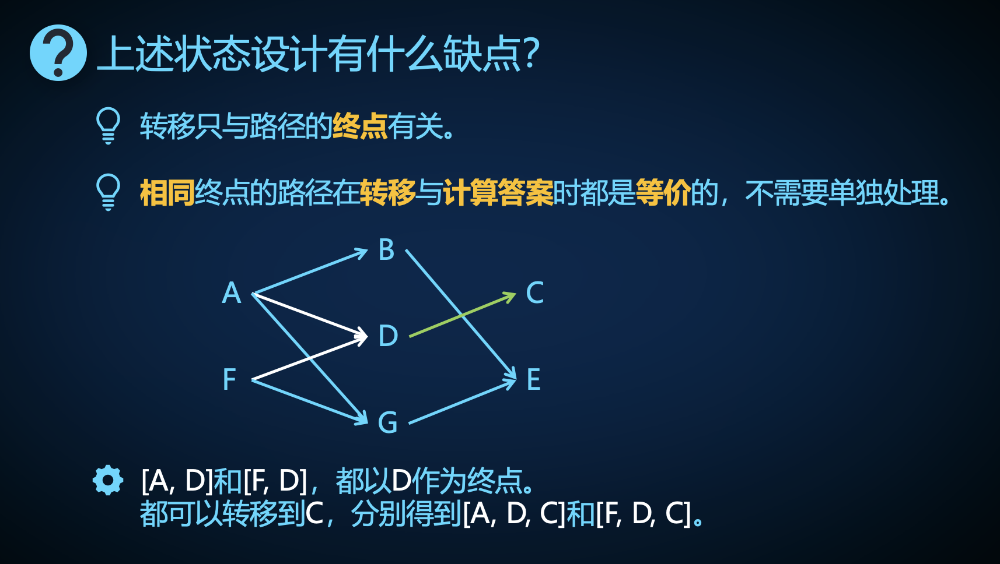
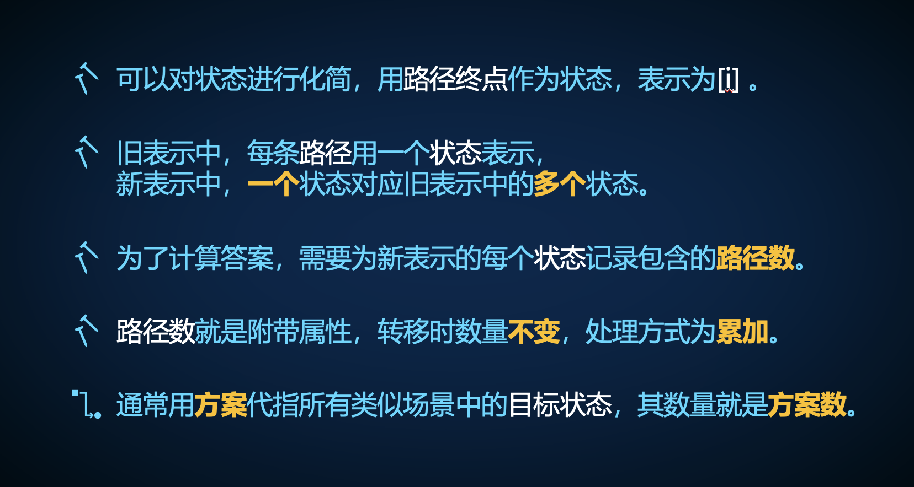
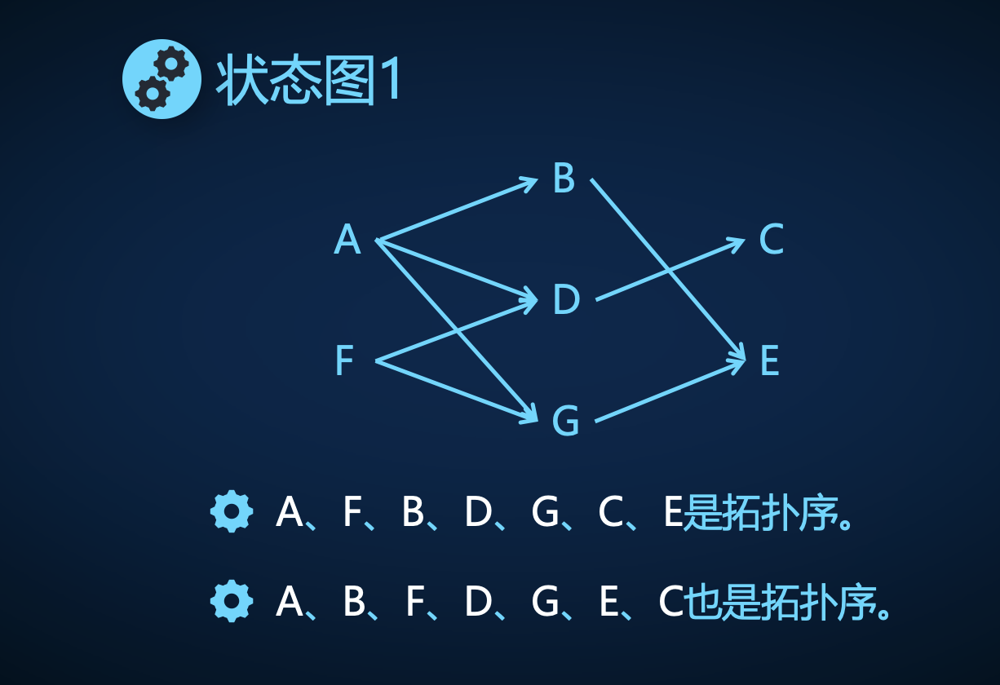
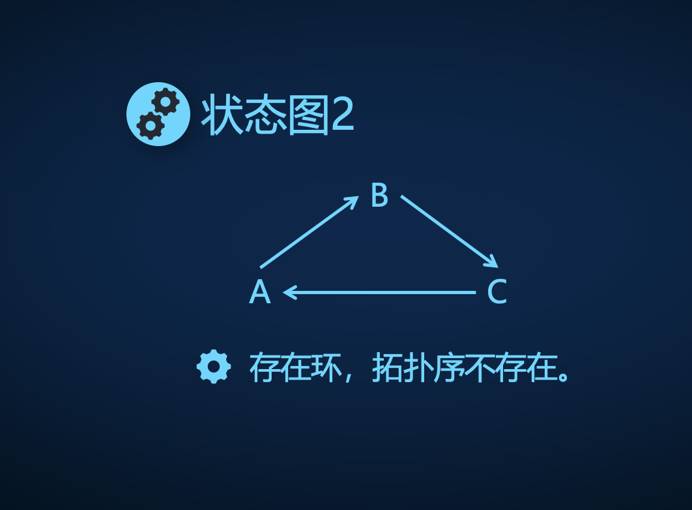
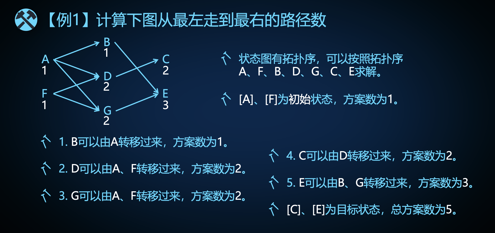

# 状态理论

状态：解决问题时所关注的属性的集合。

- 构成属性：确定状态的属性。
- 附加属性：随状态确定而确定的属性

转移：通过操作让状态发生变化的过程。

- 对于状态 $A$ 到状态 $B$ 的转移，如果存在状态 $B$ 到状态 $A$ 的转移，称这两个转移互为逆向转移。

状态的分类：

- 初始状态：一开始已知的状态。
- 目标状态：问题求解的状态。
- 合法状态：满足题目中限制条件的状态。
- 非法状态

问题的分类：

- 可行性问题：判断目标状态是否存在。（状态图遍历，递推）
- 方案数问题：求解符合条件的目标状态的数量。（暴力枚举，暴力搜索，递推，组合数学）
- 最优化问题，在所有目标状态中，求出指定的最优属性值（最优状态）。（暴力搜索，贪心，二分，动态规划，图论算法）

算法的时空复杂度与状态和转移相关：

- 与状态的数量相关。
- 与转移的数量、转移过程的复杂度相关。

# 递推理论

需要通过每一道题目的学习来深刻体会以下理论。

## 附加属性

在动态规划题目中，经常遇见以下两种题目类型：求方案数、求最值。方案数通常采用累加运算，最值通常采用最值运算。

方案数和最优化属性不同于状态，他们属于状态的附加属性，跟随状态的转移来计算：

- 计算状态只需要在首次遍历到该状态时记录，忽略后续重复的状态
- 而方案数和最优化属性值的计算则与到达当前状态的所有转移相关，一般需要处理完这些所有转移才能得到答案。

在递推中，最常出现的附加属性是**方案数**。

将路径本身作为状态的缺点：

- 状态的描述不够简单。
- 当上图变得复杂，清楚的描述状态、计算不同路径数将变得异常复杂，容易超时。

可以发现，状态的转移只与路径的终点有关，我们可以将终点一样的路径合并状态。

在化简的状态表示下：

- $(A), (F)$ 作为初始状态，方案数为 $1$。
- 可以计算出状态 $(D)$ 的方案数为 $2$，对应了路径 $A \rightarrow D, F \rightarrow D$。

## 拓扑序与有向无环图 DAG

当上述状态转移图变得复杂时，无法肉眼确定计算状态和附加属性的顺序，需要找到一种方法确定计算顺序。这种顺序就类似于做事顺序，一些事情必须在另一些事情之前完成。

### 定义

拓扑序：根据转移对状态排序的结果。

- 从图论角度来看，我们可以状态视作为点，转移视作为连接两点的有向边。对于任意一条有向边 $u \rightarrow v$，$u$ 在拓扑序中的位置必须在 $v$ 之前。
- 从状态转移的视角来看，这要求转移总是由拓扑序中靠前的状态转移到靠后的状态。

对于状态转移图而言，拓扑序不一定唯一，也不一定存在。而拓扑序存在的等价条件为状态转移图为有向无环图（Directed Acyclic Gragh）。

我们可以把拓扑序作为计算状态和附加属性的顺序。如此:

- 将来不影响过去：当某个状态的附加属性计算完毕，在后续过程中该已计算过的状态的附加属性不会再变化。
- 过去不影响将来：未来可以采用的转移只与当前所处的状态相关，而不关心如何从初始状态转移到当前状态。

这个就是递推和动态规划中的**无后效性**。

## 转移过程三要素

起始状态、转移、结束状态。

- 从图论的视角来看，起始状态是起点，转移是有向边，结束状态是终点。

已知任意两要素，就可以计算出第三个要素：

- 状态关联：已知起始、结束状态，检查其之间是否存在转移（存在关联）。
- 正向转移：已知起始状态和转移规则，可以推出结束状态。
- 反向转移：已知结束状态和转移规则，可以反推出起始状态（要求转移规则可逆）。

以搜索为例：

- $01$ 迷宫中两个相邻网格上的数字决定其之间是否存在转移。
- 通过在一个序列尾部加入更大元素的正向转移来生成组合。
- 遍历所有方案的深搜需要回溯，而回溯需要使用反向转移。

## 非法状态

求解方案数问题时，非法状态对应的方案数为 $0$，可以直接累加处理。

- 方案数取模时，$0$ 不能表示非法状态。

求解最优值时，通常在初始时给所有状态初始化一个极劣值，不能处理的非法状态将一直保持极劣值。

# 记忆化搜索

分治思想：将大的原问题分解为具有相同求解结构的小的重复的子问题进行求解

- 不断分解到一个极小的子问题得到答案。

- 对小问题答案的合并可以得到原问题的答案。

将问题类比为状态:

- 大问题是结束状态，子问题是起始状态，分治过程是反向转移。
- 极小的子问题就是初始状态，原问题就是目标状态。
- 将大问题不断分解为小问题，然后不断合并小问题的答案得到大问题的题解，体现了【从小到大】的拓扑序。

- 从目标状态开始搜索，沿着拓扑序的路径反着推回初始状态，将答案汇总。

暴力分治求解，时间复杂度过高，如果我们在第一次求解状态的时候就记录它的答案，后续再遍历该状态时直接获取答案，大大降低时间复杂度。在实战中记忆化搜索通常用 `-1`、极值等来表示状态未求解。

优点：

- 使用记忆化搜索要求状态转移具有拓扑序，但是无需知道拓扑序具体长啥样，适用于拓扑序不直观的问题。
- 在实战中，当你确信一道题目是递推、DP，但是无法确定状态转移的拓扑序时，使用记忆化搜索。

缺点：

- 无法使用诸如前缀和等优化技术。
- 代码比较复杂。
- 递归需要使用额外空间，时空复杂度常数比较大。