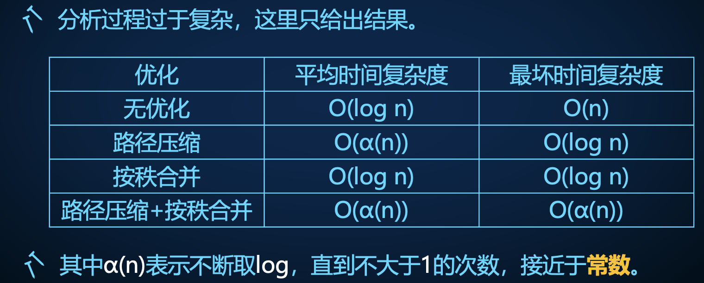

# 并查集

我们经常会遇到一类这样的对元素进行分类的问题：

- 查询元素所属的集合。
- 合并一个集合至另一个集合中。

我们可以对元素和集合进行编号，在合并操作时维护每个集合内的元素，同时记录每个元素所属的集合，例如在把 $A$ 集合中的元素合并到 $B$ 集合，需要把 $A$ 集合中的每个元素加入到 $B$ 中，同时将这些元素所属的集合标记为 $B$。

```cpp
set<int> s[MAXN];  // 集合
int b[MAXN];       // 元素所属集合

void Merge(int A, int B) {  // 合并
  for (int x : A) {
    s[B].insert(x);
    b[x] = B;
  }
  s[A].clear();
}
```

单次合并中，时间复杂度至少 $O(N)$，其中 $N$ 为元素数量。而查询速度 $O(1)$。

## 并查集

并查集是一种支持不相交集合的查询和合并操作的数据结构：

- 每个集合用一棵树表示，树中的结点就是集合中的元素。
- 使用树中的根节点作为集合的代表元素。换句话说，查询元素所属的集合就是查询元素所在树的根。
- 将 $A$ 集合并入到 $B$ 集合中时，建立一条儿子为 $A$ 父亲为 $B$ 的边。树上的边就表示了一次集合合并操作。
- 整个并查集是一个森林。

我们常使用父亲表示法 $fa_i$ 维护并查集，初始时每个元素 $i$ 各自属于一个独立的集合，可以使用自身编号 $i$ 或者 $0$ 来表示该元素的父亲 $fa_i$，查询元素所属集合，可以用递归实现。

```cpp
int fa[N];

void Merge(int A, int B) {  // A 和 B 是两个不同集合的树根，合并
  fa[A] = B;                // 建立一条边
}

int Find(int x) {  // 查询所属集合
  return fa[x] == x ? x : Find(fa[x]);
  // return !fa[x] ? x : Find(fa[x]);
  // 也可以使用非递归实现，自行完成
}

iota(首地址，尾地址，x); // 把 [首地址，尾地址) 初始化为 x 开始的整数
iota(fa + 1, fa + n + 1, 1);  // 初始化集合
// fill(fa + 1, fa + n + 1, 0);
```

可以发现此时合并操作 $O(1)$，而查询时间复杂度 $O(N)$。

## 优化

有两种独立的优化方法。

### 路径压缩

查询时，我们更多关心树的根节点是谁。因此在一次查询之后，只需要保留查询路径上每个元素对应集合的最后一次合并操作，也就是说，让元素的父亲直接变为根，那么这些元素在后续的查询中便可以跳过许多次合并。

该优化被称为路径压缩。

```cpp
int Find(int x) {
  return fa[x] == x ? x : fa[x] = Find(fa[x]);
  // return !fa[x] ? x : fa[x] = Find(fa[x]);
}
```

可以注意到的是，原有的合并信息（也就是树的结构信息）会在路径压缩中损失。

### 启发式合并（按秩合并）

当集合是对等情况下，例如说把集合 $A$ 和 $B$ 进行合并，既可以把 $A$ 合并到 $B$，也可以把 $B$ 合并到 $A$。基于贪心的想法，我们可以：

- 将元素数量小的集合合并到大集合中。
- 将高度小的集合（树）合并到高度大的集合中。

这样的小往大合并的思想称为启发式合并。注意到，将使用高度作为参考指标进行合并，不需要考虑路径压缩时对树的高度的影响。

```cpp
int fa[MAXN], sz[MAXN];

void Merge(int A, int B) {  // 按集合大小启发式合并
  if (sz[A] > sz[B]) {
    swap(A, B);
  }
  fa[A] = B, sz[B] += sz[A];
}

int Find(int x) {  // O(log n)
  // return fa[x] == x ? x : fa[x] = Find(fa[x]); // 可以同时使用路径压缩
  return fa[x] == x ? x : Find(fa[x]);
}

iota(fa + 1, fa + n + 1, 1);
fill(sz + 1, sz + n + 1, 1);
```

```cpp
int fa[MAXN], h[MAXN];

void Merge(int A, int B) {  // 按集合所对应的树的高度启发式合并
  if (h[A] > h[B]) {
    swap(A, B);
  }
  fa[A] = B, h[B] += h[A] == h[B];
}

// 查询部分一致

iota(fa + 1, fa + n + 1, 1);
fill(h + 1, h + n + 1, 1);
```

对于启发式合并的时间复杂度证明：

- 令 $A, B$ 为两个集合，$n, m$ 为两个集合目前大小，且 $n \le m$。
- 把集合 $A$ 合并到集合 $B$ 中，合并后 $B$ 的大小为 $n + m \ge 2n$。
- 也就是说，每次被合并的元素（集合 $A$ 中的元素）所处的集合大小在一次合并过程之后至少翻倍。
- 每个元素所在集合大小至多翻倍 $O(\log N)$ 次。
- 此时每个集合对应的树的高度至多为 $O(\log N)$。

### 查询的时间复杂度



如果有 $N$ 个元素，$M$ 次集合合并和查询操作：

- 在只用路径压缩的情况下，时间复杂度为 $O(M + N \log N)$，$O(N \log N)$ 的部分为 `Find()` 的递归次数的复杂度。
- 在只用启发式合并的情况下，时间复杂度为 $O(M \log N)$​。
- 如果同时使用两种优化，时间复杂度为 $O(M + N \alpha(N))$，接近于常数。

# 应用

除非特殊说明下，路径压缩和启发式合并均可。

## 图的连通块

### 1

>洛谷 P3367（逐月 P1370）
>
>$m$ 次操作，初始时有一个 $n$ 个孤立点的无向图。每次操作为在无向图上加一条边或查询两点连通性。

由于只需要维护结点之间的连通性，我们可以将一个连通块视为一个集合来维护。加边就是合并集合。注意合并是合并两点所属的集合，而不是两个点本身。

```cpp
void Merge(int x, int y) {
  int fx = getf(x), fy = getf(y);
  if (fx != fy) {
    fa[fx] = fy;
  }
}
```

对于逐月 P1370，当然你也可以用搜索搜出连通块，然后进行判断。

> 洛谷 P1536
>
> CSES 1676

### 2

>洛谷 P1197
>
>给定一张无向图，依次删除 $k$ 个点和与其关联的边，求每次操作后图中连通块数量。

 不妨先将所有点删除，然后按时间倒序变为加点操作。加点时就把该点与它的未被删除的邻点所在的连通块集合合并起来。

加边 = 合并集合，每合并一次两个不同集合，连通块数量少一。

### 3

>洛谷 P1955

对于相等的约束条件使用并查集维护，对于不等进行判断是否在同一个集合内。注意离散化的问题。

以上三题可以看出，并查集可以用来维护某类等价性、传递性的问题。

> 51Nod 1515
>
> hdu 6109

## 贪心，生成树

### 1

>逐月 P1372

定义 $dist(i, j)$ 表示 $i$ 和 $j$​ 之间每条简单路径上最大边权的最小值。

贪心。按边权从小到大枚举每条边，如果边的两个端点属于不同连通块，则加入该条边合并两个连通块，并且从两个连通块中各任取一点 $i, j$ 都有 $dist(i, j)$ 为该条边边权。每加入一条边就统计该条边对答案的贡献：两个连通块大小的成绩。使用并查集维护连通性和连通块大小。

证明，反证法：

- 令按上述算法，点 $a$ 和 $b$ 第一次属于同一连通块时加入的是第 $i$ 条边，边权为 $w_i$。
- 考虑使用上述算法构造前 $i$ 条边形成的图。如果存在某条边 $j$，使得 $w_j = dist(a, b) \lt w_i$，此时边 $j$ 一定在图上，意味着加入边 $i$ 前 $a, b$ 连通，矛盾。

>洛谷 P1111

### 2

>CSES 2101
>
>两种操作，加边，查询两点最早在第几次操作后连通

构造最小生成树，边权为第几次加入图中。求生成树上两点间的边权最大值，lca。

也可以使用启发式合并，直接在并查集做倍增找 lca，而不用构造生成树。

## 启发式合并

### abc329_f

启发式合并，时间复杂度 $O(Q + N \log N \log N)$。

### hdu 6109

必须在线做法。并查集维护传递性，不等于关系没有传递性。

暴力对每个变量 $u$ 维护属于哪个集合 $S_u$、不相等集合 $T_u$。

- $x_i = x_j$，$j \in T_i$ 矛盾，否则：
  - 合并 $S_i, S_j$，合并 $T_i, T_j$。
- $x_i \ne x_j$，$j \in S_i$ 矛盾，否则：
  - 把 $S_i$ 中的元素合并到 $T_j$，把 $S_j$ 中的元素合并到  $T_i$​ 中。

使用启发式合并维护合并 ，时间复杂度 $O(N \log N \log N)$。

## 拆点

### 1

>洛谷 P1892

对于每个点 $i$ 拆成两个点 $i + n$，表示与 $i$  为朋友和敌人的集合。如果 $x, y$ 是朋友，合并 $x, y$ 所属集合；如果 $x, y$ 是敌人，合并 $x, y + n$ 和 $x + n, y$​​ 所属的集合。

- 注意，朋友的敌人（敌人的朋友）不能推导出对应关系。

为了方便求解团伙数量，合并时应该让集合的根节点为前 $n$ 个点。

>洛谷 P2024

类似的道理，每个点 $x$ 拆为 $3$ 个点 $x, x + n, x + 2 * n$​，用来表示动物的种类：

- 集合 $x$ 表示与动物 $x$ 同类的动物集合。
- 集合 $x + n$ 表示吃 $x$ 的动物集合。
- 集合 $x + 2n$ 表示被 $x$ 吃的动物集合。

如果是 `1 x y`，合并 $x, y$、$x + n, y + n$、$x + 2n, y + 2n$。

如果是 `2 x y`，合并 $x, y + n$、$x + n, y + 2n$、$x + 2n, y$。

如何判定非法？

>CF776D

### 2

>洛谷 P1525

将每个人拆分为两个点表示和 $i$ 是否同一个监狱的集合。按怨气值从大到小的顺序给事件排序，每次尽量将冲突的人放在不同的监狱，即合并 $x, y + n$ 和 $x + n, y$​ 所属的集合，直到冲突。

也可以二分答案+二分图判定。

## 区间覆盖

模型：出度为 $1$​ 的有向图，查询每个出发后的终点。

把每个区间视为一个集合

### 1

>给定一个长度为 $n$ 的 $01$ 序列 $a_1, \dots, a_n$，一开始全是 $0$，有 $m$ 次操作：
>
>- `1 x`：令 $a_x = 1$。
>- `2 x`：求后缀中 $a_x, a_{x + 1}, \dots, a_n$ 中从左往右看的第一个 $0$ 的位置。

并查集维护。令 $f_i$ 表示 $a_i, a_{i + 1}, \dots, a_n$ 中第一个 $0$ 的位置，初始时 $f_i = i$。

- 对于操作 $1$，如果操作前 $a_x = 0$，那么就 $f_x = Find(x + 1)$​。
- 对于操作 $2$，就是 $Find(x)$​。

路径压缩比较简单，按秩合并麻烦但可行。

### 2

>洛谷 T184100
>
>给定一个长度为 $n$ 的 $01$ 序列 $a_1, \dots, a_n$，一开始全是 $0$，有 $m$ 次操作：
>
>- `l r`：令 $a_l, \dots, a_r$ 全部赋值为 $1$。
>
>$m$ 次操作后查询 $0$ 的数量。

显然不能暴力赋值。每次赋值时，找到区间中的第一个 $0$​ 进行赋值，也就是上题的操作。

### 3

>洛谷 P2391
>
>给定一个 $n$ 个点的环，每个点颜色初始为 $0$。有 $m$ 次操作：
>
>- `l r c`：给环上一段区间的点染色为 $c$。
>
>求 $m$ 次操作后每个点的颜色。

对于一个点来说，我们只关心最后一次覆盖的颜色。因此我们可以按照时间倒序的方式给区间染色即可。

### 4

>洛谷 P2422

某些 RMQ 的离线版本。

### 5

>abc295_g

区间覆盖的树上版本。

## 带权并查集

特指带边权。这一部分题目的讲解将放在数据结构章节中讲解。